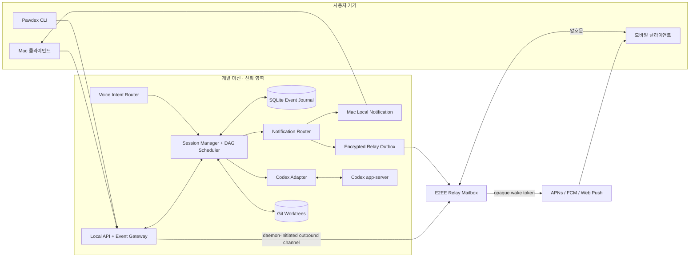
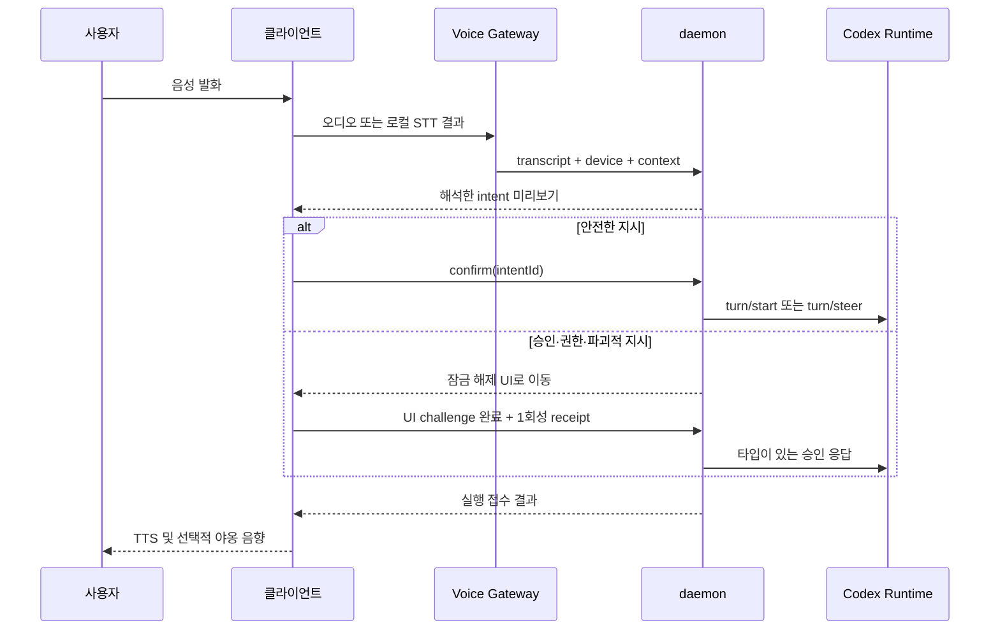

# Pawdex 기술 설계서

> 상태: **제안안(Proposal)**
> 대상: Pawdex v0.1~v1
> 최종 수정: 2026-09-12
> 범위: 런타임, 병렬 실행, 알림, 음성, 보안, 운영. UI/시각 디자인은 범위 밖이다.

## 1. 문서의 위치

현재 저장소의 daemon과 web 코드는 Codex app-server 연동 가능성을 확인한 **기술 스파이크**다. 공개 API나 영속 포맷으로 간주하지 않는다. 이 문서와 [PROTOCOL.md](./PROTOCOL.md)는 실제 구현을 시작하기 전에 합의할 목표 구조와 계약을 정의한다.

구현 원칙은 다음과 같다.

- 로컬 머신이 실행과 데이터의 기준점이다. daemon은 기본적으로 loopback에만 바인딩한다.
- Codex app-server는 버전이 바뀔 수 있는 외부 계약이다. 원문 JSON-RPC를 제품 전체로 누출하지 않는다.
- 원격 클라이언트에 임의 명령을 받는 raw shell API를 제공하지 않는다.
- 쓰기 작업은 기본적으로 독립 Git worktree에서 실행한다.
- worktree는 Git 변경 격리 수단이지 OS/process/network/secret sandbox가 아니다. Codex의 sandbox·approval을 우회하는 실행 플래그를 사용하지 않는다.
- 승인, 권한 상승, 파괴적 작업은 타입이 있는 요청과 사용자의 명시적 확인을 거친다.
- 복구 가능한 event journal을 먼저 기록한 뒤 클라이언트와 알림으로 전달한다.

## 2. 목표와 비목표

### 목표

1. 한 개발 머신에서 여러 Codex 세션을 동시에 실행하고 상태를 일관되게 보여준다.
2. `입력 필요`, `완료`, `실패`를 놓치지 않고 Mac과 모바일에 알린다.
3. 사용자가 음성으로 다음 지시, 세션 선택, 안전한 중단을 수행할 수 있게 한다.
4. 하나의 목표를 의존성이 있는 작업 그래프로 분해해 독립 작업을 병렬 실행한다.
5. daemon 재시작, 네트워크 단절, 중복 요청 뒤에도 상태와 승인을 안전하게 복구한다.
6. Codex app-server 버전 변화가 adapter 밖으로 전파되지 않게 한다.

### 비목표

- Pawdex가 자체 셸 호스팅 서비스가 되는 것
- 사용자의 확인 없이 브랜치 병합, 파일 삭제, 권한 상승을 수행하는 것
- 첫 버전에서 범용 CI/CD 오케스트레이터를 대체하는 것
- 첫 버전에서 여러 사용자 조직, 결제, 엔터프라이즈 RBAC를 완성하는 것
- UI 테마, 캐릭터 애니메이션, 최종 음향 디자인을 확정하는 것

## 3. 전체 구조



내부 Local Alpha에서는 `Relay`와 실제 Web Push 없이 Mac 로컬 알림, foreground event, provider fake만 검증한다. 실제 모바일/Web Push와 deep-link E2E는 기기 페어링·outbound E2EE relay가 준비된 원격 단계에서 함께 검증한다. 공개 P0에서는 이 인증된 원격 경로를 포함한다. 원격 연결을 단계적으로 붙여도 프로토콜을 다시 만들지 않도록 event envelope, device identity, cursor는 처음부터 구현한다.

## 4. 컴포넌트 책임

### 4.1 Local daemon

하나의 사용자 프로세스로 실행되는 제어 평면이다.

- HTTP 명령 API와 WebSocket 이벤트 스트림 제공
- 프로젝트, 세션, 턴, 태스크, 승인, 알림 설정 관리
- global/Machine/Project durable 실행 queue와 lease 관리
- SQLite transaction으로 명령 처리 결과와 이벤트를 원자적으로 기록
- app-server 프로세스 감독, 재시작, 호환성 확인
- worktree와 동시성 슬롯 관리
- TaskAttempt/Dispatch fencing, ResourceClaim/Lease, RunBudget, Checkpoint/Decision Gate 관리
- frozen ExecutionProfile, RunManifest, ContextPackage로 실행 입력과 결과 provenance 관리
- 로컬 알림 및 원격 relay outbox 관리
- P0 local CLI에는 게시된 schema에서 생성한 API client만 제공하고 App Server stdio, SQLite, OS process control 직접 접근을 허용하지 않음

기본 주소는 `127.0.0.1` 또는 Unix domain socket이다. daemon은 LAN 또는 public interface에 직접 바인딩하지 않는다. 원격 기기 연결은 daemon이 외부 E2EE relay로 만드는 outbound 연결만 사용한다. 개발용 direct bind 예외도 제품 빌드에는 포함하지 않는다.

### 4.2 Codex adapter

위치는 `apps/daemon/src/codex`로 고정한다. 공식 app-server가 제공하는 thread/turn/item JSON-RPC를 Pawdex 도메인 명령과 이벤트로 변환한다.

- 연결마다 `initialize` → `initialized` 핸드셰이크 수행
- `thread/start`, `thread/resume`, `thread/fork` 수명 주기 래핑
- `turn/start`, `turn/steer`, `turn/interrupt` 명령 래핑
- app-server 서버 요청을 protocol canonical `approval.requested`로 변환한다. command/file/permission/user-input/MCP는 payload의 kind로 구분한다.
- 알 수 없는 **notification**은 원문 hash와 메서드만 진단 기록하고 상태 변경 없이 안전하게 무시
- 알 수 없는 **JSON-RPC server request**는 절대 무시하지 않고 fail-closed 오류로 응답한 뒤 해당 세션을 reconcile하고 `reconciliation_required` attention 생성
- 업스트림 request id와 Pawdex approval id 상호 매핑
- 앱 종료, timeout, malformed message를 정규화된 오류로 변환

`thread/start|resume|fork`와 `turn/start`처럼 응답으로 upstream ID를 얻기 전에 notification이 먼저 도착할 수 있는 호출은 **acquisition window**로 다룬다. adapter는 스키마 검증을 통과한 frame을 operation별 bounded buffer에 잠시 보관하고, 응답으로 Pawdex aggregate와 upstream ID의 매핑을 확정한 뒤 journal transaction 안에서 수신 순서대로 reduce한다. buffer의 frame/byte/time 한도를 넘거나 매핑을 확정할 수 없으면 해당 operation을 `outcome_unknown`으로 닫고 세션을 reconcile하며 Attention을 만든다. frame을 버리거나 임의 Session/TaskAttempt에 귀속하지 않는다.

Task가 실행될 때 adapter에서 scheduler로 넘어가는 모든 runtime 관찰과 결과에는 daemon이 발급한 `taskAttemptId`와 `dispatchId`가 붙는다. reducer는 둘이 Task의 현재 attempt와 active dispatch에 모두 일치할 때만 Task, Artifact, Verification, Lease projection을 바꾼다. 늦게 도착한 이전 dispatch 결과는 진단 journal에는 남길 수 있지만 성공 처리, 산출물 채택, lease 해제, 통합을 일으키지 못한다.

server request capability 정책은 명시적으로 allowlist한다. P0는 command/file/permission approval, blocking/nonblocking user input, MCP elicitation만 지원한다. `item/tool/call` 같은 dynamic tool, 인증 갱신 요청, attestation 요청은 해당 app-server capability, Pawdex feature flag, 타입 구현이 모두 있을 때만 활성화한다. 협상되지 않은 요청은 위 fail-closed 경로를 탄다. 인증 갱신 token과 attestation 결과는 journal이나 클라이언트 이벤트에 기록하지 않는다.

한 app-server 프로세스가 여러 thread를 다중화하는 구성을 기본으로 한다. 프로세스 단위 격리가 필요해질 때도 adapter의 `CodexRuntime` 인터페이스 뒤에서 전략을 바꾼다.

권장 인터페이스는 다음과 같다.

```ts
interface CodexRuntime {
  connect(): Promise<RuntimeCapabilities>;
  createThread(input: CreateThread): Promise<RuntimeThread>;
  resumeThread(threadId: string): Promise<RuntimeThread>;
  forkThread(input: ForkThread): Promise<RuntimeThread>;
  startTurn(input: StartTurn): Promise<RuntimeTurn>;
  steerTurn(input: SteerTurn): Promise<void>;
  interruptTurn(input: InterruptTurn): Promise<void>;
  respondToRequest(input: TypedRuntimeResponse): Promise<void>;
  events(): AsyncIterable<RuntimeEvent>;
  close(): Promise<void>;
}
```

### 4.3 Session Manager

`Pawdex session id`와 `Codex thread id`를 분리한다. 사용자에게는 안정적인 Pawdex id만 노출한다.

- 세션 상태 전이 검증
- 세션별 활성 턴은 최대 하나로 제한
- 실행 중 추가 지시는 `turn/steer`, 준비/완료 상태의 새 지시는 `turn/start`로 라우팅
- 대기 승인과 원래 app-server request id의 수명 주기 관리. `serverRequest/resolved`는 일치하는 요청 하나만 해결하며 다른 blocker를 보존
- app-server 이벤트의 중복·역순 수신 방어
- 세션 상태 변경과 attention 생성의 원자성 보장

세션 상태는 마지막 이벤트 하나로 추정하지 않는다. `Thread.status`, `thread/status/changed`, 현재 turn 상태, `activeFlags.waitingOnApproval`, `activeFlags.waitingOnUserInput`, 미해결 blocking request를 함께 reducer에 넣는다. `serverRequest/resolved` 후에는 남은 blocker와 현재 turn을 다시 계산하며 무조건 `running`으로 복귀하지 않는다. user-input 요청의 `isBlocking=false`는 attention만 생성하고 세션을 `needs_input`으로 바꾸지 않는다.

upstream mapping/reducer가 계산한 Session 상태가 달라지면 Session projection 변경과 protocol canonical `session.state_changed`를 같은 SQLite transaction에 기록한다. Approval/Turn/runtime 관찰 이벤트만 남기고 Session 상태를 암묵적으로 바꾸지 않는다.

정규 상태와 이벤트 규칙은 [PROTOCOL.md](./PROTOCOL.md)에 정의한다.

### 4.4 DAG Scheduler

오케스트레이션 단위는 `Plan`, `Task`, `TaskAttempt`, `Dispatch`다. Plan은 `draft → proposed → editing → validated → frozen → confirmed → running`을 거친다. `confirmed` 전에는 어떤 task도 실행하지 않으며, `frozen` 이후 수정은 새 revision과 재검증을 요구한다. retry는 같은 Task를 덮어쓰지 않고 새 TaskAttempt와 새 Dispatch를 만든다.

- `Plan`: 사용자 목표, 대상 프로젝트, 정책, 전체 상태
- `Task`: 프롬프트, 의존 태스크, 읽기/쓰기 모드, 예상 산출물, 실행 세션
- `DependencyBinding`: 선행 Task의 typed Artifact/commit을 후속 Task 입력에 연결하는 계약
- `TaskAttempt`: 한 번의 불변 실행 시도와 결과
- `Dispatch`: worker/runtime에 넘긴 한 시도의 delivery identity. 모든 완료·heartbeat를 fence한다.
- `ResourceClaim`: canonical resource key에 대한 `shared|exclusive` 요구
- `Checkpoint`: 실행을 멈추는 durable typed 조건과 사용자의 Decision Gate
- `RunBudget`: Plan 전체와 Task/Attempt에 적용되는 hard cap

스케줄러 규칙:

1. 모든 선행 태스크가 `succeeded`인 `queued` 태스크만 실행 후보가 된다.
2. 실패한 선행 태스크가 있으면 후속 태스크는 `blocked`가 된다. 자동 우회는 정책에 명시된 경우만 허용한다.
3. P0는 global, Machine, Project 세 동시성 제한을 모두 적용한다. 모델/provider별 별도 한도는 P1 확장으로 둔다.
4. 읽기 전용 태스크는 같은 checkout을 공유할 수 있다. 쓰기 태스크는 태스크별 worktree를 사용한다.
5. 선언된 ResourceClaim을 canonical 순서로 전부 얻지 못하면 실행하지 않는다.
6. 재시도는 오류가 재시도 가능하고, 아직 side effect 확정 전이며, RunBudget의 attempt 한도 안일 때만 새 TaskAttempt/Dispatch로 수행한다.
7. 완료 산출물을 다른 태스크에 전달할 때는 전체 대화가 아니라 명시된 immutable artifact, commit/tree OID와 짧은 redacted handoff 요약을 사용한다.
8. 현재 TaskAttempt/Dispatch와 일치하지 않는 heartbeat·완료·산출물은 stale로 격리하고 Task 상태를 바꾸지 않는다.
9. typed Checkpoint가 열리면 관련 Task와 후속 Task를 멈추고, expected revision을 검증한 Decision이 journal에 기록되기 전에는 재개하지 않는다.

validator는 DAG cycle, 존재하지 않는 dependency, write task의 managed worktree, ResourceClaim 충돌, artifact producer/consumer type, fan-in materialization 가능성, RunBudget, 동시성 한도를 검사한다. scheduler가 `ready → dispatching → running`을 전이할 때 operation row, TaskAttempt, Dispatch, queue lease, resource lease를 먼저 한 transaction으로 기록한다. commit 후에만 worker/runtime로 dispatch한다. task 종료 시 산출물은 `artifact_id`, 종류, producer attempt/dispatch, commit/blob reference, exact content hash, redacted handoff summary로 등록하며 후속 task는 frozen DependencyBinding에 선언된 artifact만 입력으로 받는다.

의존 결과는 daemon이 `ContextPackage`로 물질화한다. ContextPackage에는 frozen task instruction, 소비 Artifact ID와 hash, producer commit/tree OID, 읽기 가능한 경로, redacted handoff만 들어간다. P0 전달 전략은 immutable 결과를 참조만 하는 `reference_only`와 exact producer commit을 선언 순서대로 적용하는 `apply_commit`뿐이다. consumer worktree의 시작 tree OID와 각 적용 뒤 tree OID를 기록한다. 여러 producer를 fan-in할 때 동일 파일·동일 hunk 또는 Git 적용 충돌이 나면 자동 해결하거나 일부만 성공으로 간주하지 않고 consumer Task와 Plan을 `blocked(dependency_conflict)`로 두며 부분 worktree를 대상으로 `integration_required` Attention을 만든다. 적용 도중 충돌한 부분 worktree도 evidence로 보존한다.

ResourceClaim의 canonical key는 typed descriptor에서 daemon이 계산하고, 획득 순서는 `(resourceType rank, canonicalResourceId의 UTF-8 byte order, claimId)`로 고정한다. 모든 claim을 한 transaction에서 acquire하거나 전부 rollback해 lock 순환을 막는다. `shared`끼리만 공존할 수 있고 `exclusive`는 단독이다. ResourceLease는 attempt/dispatch에 귀속되고 TTL, heartbeat, generation을 가진다. TTL 만료는 곧바로 다른 실행에 자원을 넘기는 신호가 아니다. 먼저 managed process와 worktree/Git 상태를 reconcile해 기존 실행이 끝났거나 격리됐음을 증명한 뒤 회수한다.

각 frozen Plan은 다음 hard cap을 가진 `RunBudget`을 포함한다.

- 최대 Task 수(`maxTasks`)와 DAG 깊이(`maxDepth`)
- Task별 최대 attempt 수(`maxAttemptsPerTask`)
- Plan 실행 wall-clock 시간(`maxWallTimeMs`); deadline은 journal에 절대 시각으로 저장하며 daemon 재시작이나 입력 대기로 초기화하지 않음
- resident runtime 수(`maxResidentRuntimes`); active와 needs-input resident를 모두 포함
- durable/ephemeral 출력과 Artifact의 합산 byte(`maxOutputBytes`)
- managed worktree의 합산 디스크 byte(`maxWorktreeBytes`)
- provider가 신뢰 가능한 계측 source와 freshness를 제공할 때만 token/cost

어떤 cap도 자동으로 늘리지 않는다. 한도 소진 시 새 dispatch를 금지하고 영향을 받는 Task/Plan을 `blocked(budget_exhausted)`로 전이하며 해당 aggregate를 대상으로 Attention을 만든다. token/cost 값이 없거나 stale/추정치뿐이면 UI에 `unknown`으로 표시하고 hard-cap 판정에는 사용하지 않는다.

stall detector는 마지막 canonical progress, runtime heartbeat, managed child-process 생존, CPU/output 변화와 열린 Approval/Checkpoint를 함께 본다. 입력·승인·Checkpoint 대기는 stall이 아니다. `suspectedAfterMs`에는 Attempt health만 `suspected_stall`, `attentionAfterMs`에는 `stalled`로 바꾸고 Task Attention을 만들되 stall만으로 성공·실패를 추정하거나 process를 죽이지 않는다. 사용자 interrupt 또는 `maxWallTimeMs` 소진 때 typed `turn/interrupt`를 먼저 보내고 `interruptGraceMs`를 기다린다. 그래도 종료되지 않은 경우에도 해당 Attempt가 독점 소유하고 daemon이 직접 만든 process group과 추적 가능한 descendants만 종료하며 PID 재사용을 막기 위해 spawn identity를 다시 검증한다. 공유 app-server, 호스트의 임의 프로세스나 사용자가 연 terminal은 죽이지 않고 별도 로컬 확인이 필요한 recovery로 승격한다.

실행 요청은 global, Machine, Project queue에 정확히 하나씩 세 durable entry를 만들고 세 scope slot과 모든 ResourceClaim을 포함한 composite admission이 있어야 시작한다. 한 SQLite transaction에서 queue 한도, RunBudget, resource 상태를 검사해 전부 acquire하거나 전부 rollback한다. queue는 `running|paused`, entry는 `queued|leased|running|paused|completed|cancelled`를 사용한다. rate/usage limit은 영향 scope를 `paused`로 만들고 pause reason과 resume-after를 저장한다. dispatch 실패·terminal·cancel 시 현재 Dispatch와 일치할 때만 grant를 원자적으로 release하며, daemon 재시작 후 세 entry/lease, resource lease, managed runtime을 reconcile하기 전에는 같은 operation을 재실행하거나 lease를 재할당하지 않는다.

P0의 `needsInputSlotPolicy` 기본값은 `release_active_slot`이다. blocking 입력 대기 시 active-turn composite lease를 반납하고 entry를 `paused(waiting_on_input)`로 두되, 살아 있는 app-server thread는 global/Machine/Project별 `residentNeedsInputCount`와 별도 limit으로 계수한다. 응답 접수 후 세 scope slot을 다시 얻은 다음 upstream response를 보내며, 재시작 시 thread status/active flags/pending Approval로 paused entry와 resident count를 복구한다. `hold_active_slot`은 ProjectPolicy의 명시적 선택이고 nonblocking 입력은 lease를 바꾸지 않는다.

Task retry는 새 `TaskAttempt`, `Dispatch`, lease를 만들며 이전 Session, worktree, verification result를 보존한다. 검증은 ProjectPolicy에 등록된 immutable `VerificationTemplate`만 사용한다. template 등록·수정·폐기는 local-admin UI에서 canonical executable ID, argv slot schema, cwd policy, `inherit=false` 환경과 허용된 변수/secret-reference ID, 최대 timeout을 검토하고 expected Project revision과 명시적 확인을 제출해야 한다. output cap과 network/sandbox는 각각 RunBudget과 선택된 ExecutionProfile에서 더 좁게 적용한다. Planner와 원격 클라이언트는 allowlisted template ID/revision과 schema가 허용한 typed parameter만 선택할 수 있으며 executable, raw argv fragment, cwd, 환경 변수 이름/값, ExecutionProfile을 만들거나 바꾸지 못한다. daemon은 template에서 argv 배열을 합성하고 예약된 worktree cwd를 재검증하며 raw shell을 사용하지 않는다. 각 VerificationResult에는 실행 직전의 exact source commit/tree OID, template ID/revision/hash, exit code, duration, redacted output artifact를 기록한다. required verification이 모두 통과하고 완료 판정 순간 worktree tree OID가 검증한 OID와 같을 때만 Task가 `succeeded`가 된다. 이후 파일이 바뀌면 결과를 `stale`로 무효화하고 다시 검증한다.

여기서 source tree OID는 단순 `HEAD^{tree}`나 사용자의 staging index가 아니다. daemon은 user index를 건드리지 않는 격리된 temporary index로 tracked 파일과 frozen scope 안의 non-ignored untracked 파일을 snapshot해 Git tree OID를 만든다. ignored/secret path는 입력 tree에 포함하지 않으며 그런 경로의 내용은 VerificationResult가 검증했다고 표시하지 않는다.

Task의 `declaredWriteScope`는 frozen Plan 계약이다. runtime 관찰 중과 완료 전 `git diff --name-status`/untracked 목록을 canonicalize해 scope와 비교한다. 한 파일이라도 범위를 벗어나면 attempt를 `blocked(scope_escape)`로 멈추고 변경을 보존한 채 Attention을 만든다. 범위를 넓히려면 새 Plan revision을 만들고 DAG·claim·budget·risk를 재검증해 freeze한 뒤 사용자가 다시 confirm해야 한다. 현재 revision을 암묵적으로 수정하거나 scope 밖 변경을 성공 산출물로 채택하지 않는다.

typed integration operation은 producer의 expected commit/tree OID와 target branch의 expected head OID를 모두 CAS 조건으로 받는다. 둘 중 하나라도 달라지거나 적용 결과가 검증된 tree와 대응하지 않으면 통합을 실행하지 않고 `blocked(integration_drift|integration_conflict)` Attention을 만든다. merge/rebase/cherry-pick의 shell 문자열이나 현재 HEAD 추측을 입력으로 받지 않는다.

실행 직전에 immutable `ExecutionProfile`, `RunManifest`, `ContextPackage`를 확정한다. ExecutionProfile은 provider/model, sandbox/approval/network policy, allowlisted tool/verification template와 환경 변수 **이름** allowlist를 나타낸다. RunManifest는 Plan/Task revision, TaskAttempt/Dispatch, base commit/tree OID, profile hash, budget, claims, context package hash, daemon/adapter/runtime version을 묶는다. secret 값은 어느 객체에도 들어가지 않으며 필요한 credential은 실행 시 최소 scope로 주입하고 journal에는 reference조차 기본 저장하지 않는다. 실행 결과와 Attention은 manifest ID를 참조해 재현성과 감사를 제공한다.

P0는 사용자의 자동 분할 요청을 Planner가 초안 Plan/Task DAG로 변환하는 기능을 포함한다. 다만 자동화 범위는 분해·제안·검증까지이며, **모든 P0 Plan은 사용자가 해당 revision과 Task 목록을 confirm한 뒤에만 실행**한다. 아래 조건은 P1에서 정책 기반 조건부 자동 실행을 도입하더라도 항상 사람 확인을 요구한다.

- 세 개를 초과하는 쓰기 태스크를 동시에 시작
- 외부 서비스 변경이나 배포가 포함됨
- 예상 변경 범위가 프로젝트 allowlist 밖임
- 최종 통합 방식이 merge/rebase/cherry-pick 중 확정되지 않음

Checkpoint는 문자열 메모가 아니라 `kind`, `scope`, `trigger`, `requiredActor`, `allowedDecisions`, `state`, `revision`, `expiresAt`, `evidenceArtifactIds`를 가진 aggregate다. P0 trigger는 `before_dispatch`, `after_materialization`, `after_verification`, `before_integration`처럼 protocol에 등록된 값만 허용한다. Decision은 checkpoint ID/revision, actor/device, `continue|decline|cancel`, manifest/evidence digest, idempotency key에 결합한다. `continue`가 destructive/elevated 권한을 내포하면 일반 Plan confirm으로 갈음하지 않고 별도의 잠금 해제 UI confirmation receipt도 요구한다.

### 4.5 Worktree Manager

쓰기 태스크의 격리 단위다. worktree 경로와 브랜치는 daemon이 구조화된 인자로 Git을 직접 호출해 생성한다. 셸 문자열을 원격 입력으로 실행하지 않는다.

P0에서 독립 Session과 Plan Task의 모든 쓰기는 Git managed worktree만 사용한다. Git이 아니거나 worktree를 만들 수 없는 Project는 read-only이며, managed-copy 격리는 P1이다. 독립 Session의 worktree owner는 Session, DAG 실행의 owner는 해당 TaskAttempt다. daemon은 worktree를 먼저 예약·생성하고 정확한 cwd를 얻은 뒤 thread를 시작하며, 생성 실패를 기본 checkout 쓰기로 우회하지 않는다.

브랜치 namespace도 책임별로 분리한다. 기여자가 Pawdex 코드 변경과 PR에 쓰는 브랜치는 `codex/<type>-<feature-id>-<short-name>`이고, daemon이 실행 중 자동 생성하는 내부 브랜치는 `codex/pawdex/<plan-short-id>/<task-attempt-short-id>`다. runtime은 기여자 브랜치를 managed worktree 정리 대상으로 취급하지 않는다.

수명 주기:

1. **Preflight**: 저장소 여부, 기준 ref, dirty working tree, 동일 브랜치 사용 여부, 디스크 공간 확인
2. **Reserve**: task id에 branch/worktree 레코드, 정확한 canonical path, Git common-dir identity를 원자적으로 예약
3. **Create**: `codex/pawdex/<plan-short-id>/<task-attempt-short-id>` 형태의 내부 브랜치와 관리 디렉터리에 worktree 생성
4. **Attach**: worktree 절대 경로를 Codex thread의 `cwd`로 지정
5. **Run**: 파일 변경과 테스트 실행은 worktree 안으로 제한
6. **Inspect**: diff, 테스트 결과, commit 상태를 artifact로 기록
7. **Integrate**: 사용자가 선택한 merge/cherry-pick/patch-export를 별도 승인 명령으로 실행
8. **Cleanup**: 실행 중 프로세스가 없고 변경 보존 여부를 확인한 뒤 제거

Reserve 단계에서 branch name뿐 아니라 exact base commit OID와 base tree OID를 고정한다. Create/Attach 후 HEAD와 tree가 이 값에서 시작했는지 검증하며 symbolic ref나 움직일 수 있는 branch 이름을 이후 판단 기준으로 사용하지 않는다.

Attach와 모든 Git mutation은 요청 경로가 DB에 예약된 canonical path와 정확히 일치하고, 현재 `git rev-parse --git-common-dir` identity가 예약 당시 값과 일치할 때만 허용한다. 단순히 프로젝트 root 아래라는 이유로 신뢰하지 않는다. dirty, untracked, ignored 또는 아직 통합되지 않은 commit이 하나라도 있으면 cleanup은 항상 잠금 해제된 로컬 UI의 명시적 확인을 요구한다. 충돌을 자동으로 해결하거나 변경 있는 worktree를 자동 삭제하지 않는다. 비정상 종료 후에는 `orphaned`로 표시하고 복구 또는 정리 선택지를 제공한다.

worktree는 Git 변경 충돌과 보존을 위한 격리일 뿐 보안 sandbox가 아니다. runtime은 Codex의 sandbox/approval을 유지하고 `--dangerously-bypass-approvals-and-sandbox`나 동급 full-autonomy 플래그를 사용하지 않는다. `.env`, credential file, SSH agent socket, cloud config, keychain material은 worktree나 ContextPackage로 copy/symlink하지 않는다. 사용자가 명시한 non-secret shared directory만 canonical allowlist와 read/write mode를 frozen Plan에 기록한 경우에 한해 materialize한다.

### 4.6 Event Journal과 Projection

이벤트는 UI 전송 전에 SQLite에 기록한다. 목표는 exactly-once 실행이 아니라 **at-least-once 전달 + 멱등 소비**다.

- 단조 증가하는 머신 범위 `sequence`
- aggregate별 `revision`
- 모든 command에 `idempotency_key`와 payload hash
- upstream 호출 전에 `operations` row를 기록하고, turn start/steer에는 command id와 idempotency key로 결정적으로 생성한 `clientUserMessageId` 사용
- 상태 projection과 event append를 하나의 transaction에서 처리
- 알림은 outbox row를 같은 transaction에서 생성
- 클라이언트는 마지막 처리 `sequence`를 cursor로 저장
- 보존 구간보다 오래된 cursor는 `CURSOR_EXPIRED` 오류로 거절

`PawdexEvent`는 journal에 기록된 durable event만 뜻한다. 토큰 델타는 별도 `ephemeral` WebSocket frame이며 durable `sequence`나 aggregate `revision`을 소비하지 않는다. 따라서 delta 유실이 cursor gap으로 보이지 않는다. 최종 `item/completed` 또는 합쳐진 메시지를 canonical durable event로 저장한다. 감사가 필요한 승인과 상태 전이는 전부 보존한다.

한 SQLite transaction의 deterministic 순서는 `operation/attempt/dispatch 상태 → projection 변경 → aggregate별 event(고정 type/id 정렬) → attention → notification outbox`다. transaction이 commit된 뒤에만 sequence 순서로 client/relay/notification worker에 publish한다. publish 실패는 outbox/cursor 재전송으로 복구하며 DB commit 전 상태를 외부에 먼저 보이지 않는다. `thread/start` 결과를 받지 못한 모호한 실패는 operation을 `outcome_unknown`으로 두고 새 thread를 blind retry하지 않는다. 이후 thread list/read와 `clientUserMessageId`로 orphan을 찾고 연결하거나 사용자의 정리 대상으로 표시한다.

재연결 절차:

1. 클라이언트가 마지막 cursor와 함께 event ticket을 요청한다.
2. daemon이 ticket과 cursor의 장치/권한을 검증한다.
3. journal에 cursor가 남아 있으면 이후 이벤트를 순서대로 replay한다.
4. 없으면 snapshot과 새 base cursor를 내려준다.
5. 실시간 스트림으로 전환하는 순간까지 새 이벤트는 동일 연결 큐에 보관한다.

### 4.7 Notification Router

protocol canonical `attention.created` 이벤트를 전달 채널별 notification job으로 fan-out한다.

| Tier | 채널 | 목적 | 제약 |
|---|---|---|---|
| 0 | Mac 로컬 알림 + 로컬 음향 | 같은 머신에서 가장 빠른 알림 | daemon/companion 실행 필요 |
| 1 | foreground event + provider fake | relay 전 로컬 채널 계약 검증 | 실제 background push가 아님 |
| 2 | Web Push opaque wake-up | 설치 부담 없는 모바일 알파 | outbound E2EE relay 필수, OS/browser별 백그라운드 및 음향 제약 |
| 3 | APNs/FCM opaque wake-up | 안정적 모바일 푸시 | outbound E2EE relay, 앱 배포, push credential 필요 |

알림 정책:

- 기본 알림 대상은 `needs_input`, `completed`, `failed`다.
- `isBlocking=false` 사용자 입력 요청은 attention inbox에는 나타내되 기본 push 대상에서는 제외하며, 사용자가 별도로 활성화할 수 있다.
- dedup key는 `deviceId + attentionId + policyRevision + stage`의 canonical encoding이며 최초 전송과 각 escalation stage를 구분한다.
- `needs_input`은 사용자가 답하거나 요청이 만료되면 철회/갱신한다.
- quiet hours에는 실패를 제외하고 묶어서 보낸다. 정책은 사용자 설정으로 변경 가능하다.
- 같은 세션의 짧은 시간 내 연속 완료는 하나로 묶을 수 있다.
- public push provider payload는 relay가 내부적으로 device mailbox에 매핑하는 짧게 만료되는 1회성 `wakeToken`만 포함한다. 세션 별칭, 상태, attention id, preview, 안정적인 device 식별자는 넣지 않는다. 기기가 깨어난 뒤 E2EE relay에서 내용을 가져온다.
- Web Push에서 커스텀 소리 재생은 OS 정책에 따라 보장되지 않는다. 확실한 `야옹` 소리는 foreground 클라이언트 또는 네이티브 알림 채널이 담당한다.
- delivery 상태는 `queued`, `provider_accepted`, `device_acknowledged`, `opened`, `acted`, `failed`, `expired`로 추적한다.
- blocking/nonblocking 사용자 입력 모두 `needs_input` Attention을 만들 수 있지만 `blocking=false`는 Session 상태나 concurrency 계산을 바꾸지 않으며 알림 정책이 억제할 수 있다.

### 4.8 Voice Pipeline

음성은 실행 엔진이 아니라 입력 채널이다.



단계는 `VAD → STT → intent parse → target resolution → policy check → confirmation → command → TTS`다.

초기 intent 집합:

- `send_instruction(sessionRef, text)`
- `steer_active_session(text)`
- `create_session(projectRef, instruction)`
- `fork_session(sessionRef, instruction)`
- `interrupt_session(sessionRef)`
- `read_status(scope)`
- `answer_question(approvalId, answers)`
- `respond_approval(approvalId, decision)`

세션 별칭이 모호하면 실행하지 않고 후보를 되묻는다. 세션이 `needs_input`이면 typed answer/decision만 해당 blocker로 라우팅한다. 일반 후속 지시는 정책에 따라 `queued_after_blocker`로 저장하거나 `STATE_CONFLICT`로 거절하고 blocker를 해제하지 않는다. 사용자 질문 답변은 음성으로 제출할 수 있지만, 위험도와 무관하게 모든 approval accept는 음성으로 완료할 수 없다. 음성은 잠금 해제된 명시적 UI로 이동하거나 `decline`/`cancel`만 수행한다.

STT/TTS provider는 adapter로 격리한다. 기본값은 가능한 범위에서 온디바이스 처리이며, 외부 provider 사용 시 오디오 보존 여부와 전송 대상을 명시한다. 원본 음성은 기본 저장하지 않는다.

### 4.9 Client UX와 접근성 표현 계층

desktop과 mobile client는 개발자·비개발자용 상태 머신을 따로 만들지 않고 동일한 canonical projection과 typed action을 사용한다. 기본 계층은 쉬운 말로 목표, 현재 lifecycle stage, 영향을 받는 대상과 다음 안전 행동을 보여 주며, event ID·revision·digest·adapter payload·raw diagnostics는 명시적으로 펼치는 기술 상세에 둔다. 이 progressive disclosure는 정보를 숨겨 다른 결정을 만드는 모드가 아니라 같은 근거의 표현 깊이만 바꾼다.

근거 없는 완료 퍼센트를 합성하지 않고 검증 가능한 stage/activity/evidence만 진행으로 표시한다. provider `usedPercent`와 `min|likely|max` forecast는 출처·관측 시각·신선도·confidence와 함께 보여 주며 정확한 token 잔량, Task 완료율 또는 100% 소진 약속으로 표현하지 않는다. 상태·위험·성공은 색상뿐 아니라 icon과 text를 함께 사용하고, 핵심 interactive target은 최소 44×44 CSS px, keyboard focus와 screen-reader label을 제공한다. 모든 음성 mutation은 전사문, 해석한 action과 정확한 Project/Session/Approval target을 전송 전에 확인하며 ambiguous/low-confidence 결과를 실행하지 않는다.

### 4.10 P1 Orca-informed 확장 경계

아래 기능은 P0 계약을 침범하지 않는 **P1 후보**다. 데이터 모델은 나중에 안전하게 추가할 수 있도록 identity와 provenance를 P0부터 보존하지만, P0 완료 조건에는 포함하지 않는다.

- **`SES-004` 안전한 hibernation**: Session의 durable 상태와 runtime/process attachment를 분리한다. terminal/idle이며 현재 Dispatch, unsettled Approval/Checkpoint, active mobile attachment가 없을 때만 managed runtime 자원을 해제한다. 재개 시 같은 manifest와 thread identity를 검증한 warm resume을 우선하고, 프로세스가 사라졌다면 상태·artifact를 재구성하는 cold restore임을 명확히 표시한다. hibernation은 Task 완료나 검증을 의미하지 않는다.
- **`ORC-005` comparative candidate run**: 하나의 비교 그룹이 동일한 frozen task spec, base commit/tree OID, ContextPackage, completion/verification spec과 기본 ExecutionProfile을 공유하고, 차이는 frozen variant field로만 선언한다. 각 candidate는 별도 TaskAttempt/Dispatch/worktree와 candidate budget을 가진다. 사용자가 evidence를 보고 winner를 선택해야 하며 loser의 worktree/artifact는 자동 삭제하지 않는다. winner 선택도 integration approval이 아니다.
- **`ORC-006` Usage Window Runner**: 사용자가 이미 확정한 유한 Task 집합만 rate-limit window 안에서 보수적으로 연속 dispatch한다. 공식 App Server 수치와 로컬 이력은 forecast 입력이지 정확한 남은 token 또는 100% 소진 보장이 아니다.
- **`REV-001` line-anchored batch review**: comment anchor는 path, base/head OID, side, line, content hash를 묶는다. diff가 바뀌어 anchor가 불명확하면 `stale`로 표시하고 자동 재배치하지 않는다. 여러 comment를 immutable review batch로 묶어 정확히 한 새 agent turn의 ContextPackage로 전달한다. review submit은 코드 변경 승인이나 elevated approval을 대신하지 않는다.
- **`OBS-002` provider usage visibility**: provider별 adapter가 로컬에서 관찰 가능한 usage/rate-limit snapshot에 source, observed-at, freshness, confidence를 붙인다. Codex App Server의 `usedPercent`, `windowDurationMins`, `resetsAt`는 사용률과 window 메타데이터일 뿐 정확한 남은 token 수가 아니다. 알 수 없으면 `unknown`이고 scheduler는 신뢰 가능한 최신 값만 보수적 admission input 또는 token/cost RunBudget에 사용한다. 계정 hot-swap, quota 우회, credential export는 제공하지 않는다.

이 확장들도 모바일 raw PTY/keystroke, 범용 terminal command, SSH/port forwarding을 도입하지 않는다. 그런 기능은 별도 제품 범위와 위협 모델 없이는 Pawdex typed control plane에 추가하지 않는다.

#### ORC-006 Usage Window Runner 상세

이 기능은 `OBS-002`, `ORC-002`, `ORC-004`, `CFG-001`, `ATT-001`, `APR-001`, `APR-002`, `SEC-001`, `DEV-001`, `DEV-002`에 의존하는 P1 admission controller다. Codex 전용 `account/rateLimits/read` 및 `account/rateLimits/updated` 해석은 다른 provider와 섞지 않고 `apps/daemon/src/codex` adapter 안에 둔다. `rateLimitsByLimitId`가 있으면 선택된 limit bucket을 명시적으로 고르고, legacy 단일 `rateLimits` fallback을 썼는지 snapshot source에 남긴다. [공식 Codex App Server 문서](https://learn.chatgpt.com/docs/app-server)가 정의한 nullable `usedPercent`, `windowDurationMins`, `resetsAt`와 관찰 시각, valid-until, runtime/adapter version, payload hash, install-local redacted account binding으로 immutable `RateLimitSnapshotRef`를 만든다. account binding은 동일 runtime/account인지 비교할 때만 사용하고 원문 account ID를 저장·전송하지 않는다. 필드가 없거나 범위를 벗어나거나 capability가 협상되지 않으면 Usage Window capability를 `unavailable`로 표시하고 Run 자체를 만들지 않는다. `account/usage/read`의 lifetime/daily token activity는 남은 window나 Task forecast의 authoritative source로 사용하지 않는다.

로컬 forecast는 같은 Machine에 저장된 과거 Attempt의 시작/종료 snapshot 차이, duration, ExecutionProfile/model, coarse task class를 사용한다. prompt, 파일명, raw account ID, credential은 feature나 telemetry로 쓰지 않는다. account 전체의 외부 사용과 동시 실행 때문에 attempt별 기여를 정확히 분리할 수 없으므로 오염된 표본은 제외하거나 불확실성을 넓힌다. `(taskId, providerAdapterId, bucketId)`마다 단위를 `used_percent_points`로 고정한 `min|likely|max`, confidence, sample count, calculated-at, valid-until을 낸다. admission에는 보수적인 `max`만 쓰며 bounded max나 freshness를 확보하지 못하면 새 launch를 금지한다. 이를 token 잔량·비용·완료 가능성의 확정값으로 변환하지 않는다.

`UsageWindowPreset`은 local-admin UI에서만 생성하는 versioned policy다. 각 revision의 canonical payload와 sorted eligible membership digest는 불변이고, 수정은 새 revision/digest를 만든다. 최소 필드는 다음과 같다.

- 비어 있지 않고 중복 없는 기존 durable Queue ID 목록, 그리고 그 목록 중 stop summary target으로 지정한 정확히 하나의 `controlQueueId`
- `confirmed` Plan의 frozen revision에 속한 `queued|ready` Task만 허용하는 비어 있지 않고 중복 없는 eligibility rule
- 하나의 `providerAdapterId`에만 속하는 비어 있지 않고 중복 없는 bucket target 목록. 여러 provider는 preset과 Run을 분리함
- bucket별 목표 `targetUsedPercent` band와 `0 ≤ reserveFloorPercent < 100`; target upper bound는 `100 - reserveFloorPercent`를 넘을 수 없음
- snapshot 최대 나이 `maxSnapshotAgeMs`와 reset 직전 새 실행을 막는 `stopLaunchingBeforeResetMs`
- runner 전용 최대 concurrency와 연속 failure threshold; 이 네 수치 필드는 모두 양의 유한 정수
- 기존 Plan/Task RunBudget을 그대로 존중하는 `respect_existing` budget policy와 cost 계측이 unknown이면 멈출지 여부

preset의 `maxSnapshotAgeMs`는 provider capability hard ceiling을 완화할 수 없고 effective max age는 둘 중 더 좁은 값이다. start/admission snapshot은 `authority="provider_authoritative"`, `freshness="fresh"`, preset의 단일 `providerAdapterId`와 일치하고 `now - observedAt ≤ effectiveMaxSnapshotAgeMs`, `now < validUntil`이어야 한다. 한 번의 시작 action은 daemon 설치와 OS 사용자에 결박된 active `local_controller` Device의 local-admin UI 또는 explicit `usage_window.start` capability가 있는 active `paired_remote` Device의 unlocked authenticated UI에서만 가능하다. 두 경로 모두 같은 confirmation challenge를 foreground explicit action으로 완료한 fresh one-time user-presence receipt가 필요하다. daemon은 actor Device ID/kind와 channel binding을 현재 인증 transport에서 결정하고 receipt claims와 다시 대조하므로 local loopback token이나 CLI도 이 검증을 우회하지 못한다. `local_controller`는 relay actor가 될 수 없고 `paired_remote`는 현재 revoke/capability 상태를 통과해야 한다. receipt는 actor device/kind/channel, interaction kind, preset ID/revision/digest, sealed eligible-set digest, fresh `RateLimitSnapshotRef` ID/digest, 전체 Project/Queue/Plan/Task/QueueEntry binding digest, 현재 candidate/forecast/cost-risk preview ID/digest, expiry, nonce에 결합한다. 원격 start는 이 exact preset과 preview를 실행할 수만 있고 preset, Queue, eligible Task, scope, concurrency, budget을 바꾸는 override를 받지 않는다. 음성, 잠금 화면 알림 action, push quick action은 시작 receipt를 만들거나 runner를 시작할 수 없다. 시작 transaction은 snapshot의 `providerAdapterId`와 모든 configured bucket이 preset과 일치하는지 확인하고 install-local `redactedAccountId`를 봉인한다. 또한 중복·active·succeeded Task를 제외하고 기존 QueueEntry/Task ID를 각 한 번만 Run membership에 봉인한다. runner는 Planner 호출, 새 prompt/Task/Plan 생성, clone, 자동 retry/unblock으로 소비량을 채우지 않는다.

`UsageWindowRun`은 초기 snapshot/preview와 모든 expected binding을 검증하고 `started` event를 같은 transaction에 commit할 때 곧바로 `running`으로 생성한다. exact preset revision의 policy를 `effectivePresetPolicy`로 Run에 불변 복제하므로 이후 preset 수정·retire가 active Run의 control Queue, target/reserve, max age/buffer, concurrency/failure, budget policy를 바꾸지 못한다. start actor Device ID/kind와 channel binding·one-time receipt digest, Project policy digest, preset/eligible digest, provider/account/window identity도 보존한다. validation 실패 시 aggregate를 만들지 않는다. `user_cancelled`만 `running → cancelled`, `reconciliation_required`만 `running → failed`, 나머지 stop reason은 `running → stopped`로 reduce한다. terminal Run은 재개하지 않으며 조건이 다시 유효해져도 새 인증 start와 새 Run ID가 필요하다.

`startRevisionBindings`는 사용자가 확인한 Project/Queue/Plan/Task/QueueEntry revision, Queue admission-policy digest, Plan frozen hash, Task definition digest와 membership의 불변 감사 기록이다. `currentRevisionBindings`는 admission별 rolling CAS cursor다. 같은 Run이 만든 정상 lifecycle 전이는 상태 mutation transaction에서 current cursor를 post-transition revision으로 함께 올린다. 외부 canonical event가 revision을 전진시키면 authorization/policy/definition/frozen/membership identity가 그대로이고 상태가 계속 eligible임을 확인한 경우에만 별도 journal transaction으로 cursor를 전진시킨다. identity가 달라지면 `blocker_pending`, event 귀속이나 결과가 불명확하면 `reconciliation_required`로 멈춘다. 각 admission은 start revision을 재사용하지 않고 current cursor 전체와 sealed membership을 CAS한다. 그 다음에만 기존 scheduler가 RunBudget, global/Machine/Project lease, ResourceClaim, Approval, Checkpoint, worktree/OID 정책을 그대로 적용한다. runner concurrency는 이 한도들보다 좁은 추가 상한일 뿐 어느 것도 예약하거나 우회하지 않는다. snapshot 확인과 worker start 사이에 account/window identity가 달라지면 예약한 Dispatch를 시작하지 않고 journal에서 취소·lease release한 뒤 멈춘다.

candidate set은 sealed membership 안에서 기존 Queue priority/order를 보존한다. admission pass는 그 결정적 순서로 entry를 검사하고 모든 관련 bucket에서 `current usedPercent + forecast.max`가 target upper bound 이하이고 예상 remaining percent가 `reserveFloorPercent` 이상이며 현재 시각이 `resetsAt - stopLaunchingBeforeResetMs`보다 앞선 첫 safe Task만 admission한다. 앞선 entry가 terminal/active/duplicate이거나 현재 여유보다 큰 bounded fresh forecast를 가진 경우에만 typed skip reason을 기록하고 같은 pass의 다음 entry를 볼 수 있으며 durable Queue를 재정렬하지 않는다. sealed membership·revision/definition mismatch, Approval/Checkpoint와 dependency/resource/scope/reconciliation blocker는 lower-priority 후보로 우회하지 않고 각각 `blocker_pending` 또는 `reconciliation_required`로 Run을 멈춘다. queue와 launch slot이 남아도 safe candidate가 없고 eligibility를 바꿀 active governed Attempt/Dispatch가 없으면 `no_safe_candidate`로 즉시 중단한다. active governed Attempt가 있으면 그 bounded lifecycle event까지만 기다리며 기존 wall-time/stall cap과 reset buffer를 넘어 polling하지 않는다. 더 작은 합성 작업으로 쪼개거나 순서를 채우기 위한 Task를 만들지 않는다.

daemon crash/restart 뒤에는 persisted Run revision, latest snapshot, sealed members와 각 current TaskAttempt/Dispatch/process/lease를 reconcile한다. aggregate가 `running`이어도 fresh provider snapshot과 active pair를 모두 확정하기 전에는 executor loop를 재개하거나 새 launch를 하지 않는다.

Attempt를 예약·시작·완료·실패·취소할 때와 새 rate-limit update가 올 때마다 stable source event ID로 멱등하게 남은 sealed queue를 다시 forecast한다. 여러 관련 window가 있으면 하나라도 target/reserve/deadline 조건을 위반하는 가장 제한적인 window를 따른다. 아래 조건 중 하나면 새 launch를 중단하고 terminal stop reason, 마지막 snapshot/forecast digest, 실행·미실행 Task 목록을 journal에 기록한 뒤 `effectivePresetPolicy.controlQueueId`를 target, UsageWindowRun을 source로 하는 dedupe된 `usage_window_run_stopped` Attention을 만든다.

- 관찰값 또는 보수적 forecast가 target band에 도달하거나 다음 launch가 reserve floor를 침범함
- sealed eligible queue가 비었음
- queue와 launch slot은 남았지만 결정적 scan에서 safe candidate가 없고 기다릴 active governed Attempt도 없음
- `resetsAt`, window duration, limit bucket 또는 account-bound runtime identity가 시작 snapshot과 달라짐
- snapshot/forecast가 stale, unknown, unavailable 또는 신뢰 임계값 미만임
- 현재 시각이 reset deadline의 `stopLaunchingBeforeResetMs` 안으로 들어감
- Approval, Checkpoint, dependency/resource/scope/reconciliation blocker가 발생함
- 연속 failure threshold 도달, 사용자 cancel, 기존 RunBudget/cost 위험 또는 hard cap 발생

P1 persistence는 `usage_window_presets`(immutable revision/digest, eligible digest, control Queue와 single-provider 정책), `usage_limit_snapshots`(provider source·redacted account binding·bucket/window·세 필드·observed-at/valid-until·freshness), `usage_window_runs`(state, immutable effective preset policy, Project policy digest, actor kind/device/channel·receipt digest, 시작 snapshot/account/window identity, start/current revision binding, preview/eligible digest, forecast revision, stop reason), `usage_window_members`(run/task/queue-entry/definition/frozen hash/dispatch 상태와 admission-pass skip reason), `usage_forecasts`(source event ID, input snapshot/history digest, estimator version, provider/bucket, `min|likely|max`·confidence·sample count·valid-until)를 둔다. `(run_id, source_event_id)`, `(run_id, task_id)`, `(run_id, queue_entry_id)` unique constraint로 replay와 한 run 안의 중복 launch를 막고, lifecycle mutation과 current cursor, run/preset/snapshot/forecast state와 stop Attention은 일반 journal-first 규칙으로 기록한다. active preset, active/recent terminal Run, 그리고 보존 중인 Run이 참조하는 exact preset revision을 snapshot/replay에 포함한다.

cancel은 새 admission만 멈춘다. 이미 실행 중인 Attempt는 별도 typed interrupt가 없는 한 정상 수명 주기와 기존 budget/approval을 따른다. 정상 target/empty-queue stop도 “100% 사용”, “남은 token 0”, “할당량 완전 소진”으로 표시하지 않는다. earned reset credit consume, 구매/overage, account hot-swap은 이 컴포넌트의 호출 graph와 capability에 존재하지 않는다.

## 5. 데이터 모델

MVP 영속 계층은 SQLite WAL 모드를 사용한다. JSON 파일 저장은 스파이크에만 허용한다.

| 테이블 | 주요 필드 | 설명 |
|---|---|---|
| `projects` | `id`, `root_path`, `git_common_dir`, `policy_json` | 허용된 로컬 프로젝트 |
| `sessions` | `id`, `project_id`, `runtime_thread_id`, `state`, `revision`, `execution_mode`, `worktree_id`, `cwd` | 독립/Task 실행 Pawdex 세션 projection |
| `turns` | `id`, `session_id`, `runtime_turn_id`, `state`, `started_at`, `ended_at` | 턴 이력 |
| `plans` | `id`, `project_id`, `goal`, `base_commit_oid`, `base_tree_oid`, `state`, `revision`, `document_json`, `frozen_document_hash`, `run_budget_json`, `policy_json` | scope/artifact graph/checkpoint/budget를 포함한 crash-recoverable DAG 문서 |
| `tasks` | `id`, `plan_id`, `mode`, `state`, `current_attempt_id`, `declared_scope_json`, `risk`, `produced_artifacts_json`, `consumed_artifacts_json`, `completion_json`, `verification_json` | 세부 작업 정의와 결과 계약 |
| `task_attempts` | `id`, `task_id`, `ordinal`, `state`, `active_dispatch_id`, `lease_id`, `session_id`, `worktree_id`, `run_manifest_id`, `source_turn_id`, `result_summary`, `changed_files_json`, `artifact_ids_json`, `verification_result_ids_json` | retry별 불변 실행·결과 이력 |
| `dispatches` | `id`, `attempt_id`, `ordinal`, `state`, `worker_identity`, `issued_at`, `heartbeat_at`, `terminal_at` | 늦은 결과를 차단하는 attempt delivery fence |
| `task_edges` | `from_task_id`, `to_task_id`, `condition`, `dependency_binding_json` | typed Artifact/commit 의존성 |
| `execution_profiles` | `id`, `revision`, `role`, `provider`, `model`, `sandbox_policy`, `approval_policy`, `network_policy`, `tool_allowlist_json`, `environment_name_allowlist_json`, `content_hash` | 비밀 값 없는 immutable 실행 정책 |
| `verification_templates` | `id`, `project_id`, `revision`, `executable_id`, `argv_schema_json`, `cwd_policy`, `environment_policy_json`, `max_timeout_ms`, `content_hash`, `state` | local-admin만 관리하고 clean env를 강제하는 immutable 검증 명령 계약 |
| `run_manifests` | `id`, `attempt_id`, `dispatch_id`, `plan_frozen_hash`, `project_policy_revision`, `execution_profile_id`, `execution_profile_digest`, `model`, `base_git_revision`, `source_tree_oid`, `context_package_id`, `context_package_digest`, `runtime_versions_json` | 한 dispatch의 immutable provenance |
| `context_packages` | `id`, `attempt_id`, `plan_frozen_hash`, `task_instruction_hash`, `instruction_sources_json`, `consumed_artifacts_json`, `size_bytes`, `digest` | consumer에 전달하는 최소·redacted 입력 묶음 |
| `checkpoints` | `id`, `plan_id`, `task_id`, `kind`, `state`, `revision`, `trigger_json`, `allowed_decisions_json`, `evidence_artifact_ids_json`, `expires_at` | crash-safe typed Decision Gate |
| `worktrees` | `id`, `owner_type`, `owner_id`, `path`, `git_common_dir_id`, `branch`, `base_commit_oid`, `base_tree_oid`, `head_commit_oid`, `tree_oid`, `state`, `revision` | Session 또는 TaskAttempt 소유 자원 |
| `execution_queues` | `id`, `scope_type`, `scope_id`, `state`, `pause_reason`, `resume_after`, `active_limit`, `resident_needs_input_count`, `resident_limit`, `needs_input_slot_policy`, `revision` | global/Machine/Project queue projection |
| `queue_entries` | `id`, `queue_id`, `operation_id`, `state`, `priority`, `lease_id` | durable 실행 대기열 |
| `execution_leases` | `id`, `operation_id`, `attempt_id`, `dispatch_id`, `expires_at`, `heartbeat_at`, `generation`, `state` | 세 queue scope를 묶는 composite lease |
| `lease_grants` | `lease_id`, `queue_id`, `queue_entry_id`, `scope_type` | global/Machine/Project별 정확히 세 grant; transaction unique constraint |
| `resource_claims` | `id`, `task_id`, `resource_type`, `canonical_resource_id`, `mode`, `ordinal` | frozen Task의 shared/exclusive 요구와 canonical acquisition 순서 |
| `resource_leases` | `id`, `attempt_id`, `dispatch_id`, `generation`, `expires_at`, `heartbeat_at`, `state` | 한 Attempt의 모든 claim을 묶고 reconcile 후에만 회수 가능한 자원 lease |
| `resource_lease_grants` | `resource_lease_id`, `claim_id`, `canonical_resource_id`, `mode`, `ordinal` | 정렬된 claim별 shared/exclusive grant; 부분 획득 금지 |
| `verification_results` | `id`, `attempt_id`, `dispatch_id`, `spec_id`, `spec_revision`, `source_commit_oid`, `source_tree_oid`, `exit_code`, `duration_ms`, `passed`, `state`, `artifact_id` | exact source tree에 결합된 allowlisted 검증 결과 |
| `artifacts` | `id`, `artifact_spec_id`, `producer_attempt_id`, `producer_dispatch_id`, `kind`, `content_hash`, `commit_oid`, `tree_oid`, `reference`, `handoff_summary` | frozen ArtifactSpec과 결정적으로 연결된 immutable 결과 전달 계약 |
| `approvals` | `id`, `session_id`, `runtime_request_id`, `kind`, `request_json`, `state`, `is_blocking` | 승인 및 질문; secret answer 값은 저장 금지 |
| `attentions` | `id`, `target_type`, `target_id`, `kind`, `revision`, `resolved_at` | Session/Plan/Task/Queue/Worktree 등 사용자의 주의가 필요한 사건 |
| `events` | `sequence`, `event_id`, `aggregate_id`, `revision`, `type`, `payload_json` | append-only journal |
| `operations` | `id`, `idempotency_key`, `payload_hash`, `client_message_id`, `status`, `response_json` | upstream 전 기록, 중복 명령·모호한 결과 복구 |
| `notification_jobs` | `id`, `attention_id`, `device_id`, `policy_revision`, `stage`, `dedup_key`, `channel`, `state` | transactional outbox와 7단계 delivery 상태 |
| `devices` | `id`, `public_key`, `capabilities_json`, `last_seen_at` | 페어링된 기기 |

`RunBudget`은 frozen Plan JSON이 canonical이지만 소비량은 별도 projection/counter로 transactionally 갱신한다. counter를 손상시키거나 재시작 뒤 계산할 수 없으면 fail-open하지 않고 관련 dispatch admission을 중지한 뒤 journal/Artifact/worktree에서 재계산한다.

로컬 경로와 command preview는 민감 정보로 분류한다. secret input과 form answer 값은 DB, event, 로그에 저장하지 않고 runtime에 전달한 뒤 즉시 폐기한다. 감사 로그에는 field id, 제출/누락 여부, redacted marker와 hash 없는 길이 범주만 남긴다.

## 6. app-server 수명 주기와 호환성

공식 OpenAI 문서가 설명하는 app-server의 핵심 흐름은 연결별 `initialize`/`initialized`, thread 생성·재개·포크, turn 시작·조정·중단, streamed item/turn 이벤트, 서버 발신 승인·질문 요청이다. 구현은 이 계약을 직접 복제하지 않고 생성된 타입과 adapter fixture를 사용한다.

### 시작

1. 설정된 binary를 절대 경로로 확인하고 `--version`을 수집한다.
2. 지원 버전 범위와 비교한다. 알 수 없는 버전은 기본적으로 경고 후 읽기 전용 진단 상태가 된다.
3. stdio transport로 app-server를 시작한다.
4. `initialize`를 보내고 서버 정보/기능을 저장한다.
5. `initialized`를 보낸다.
6. DB에 있는 활성 thread를 제한된 병렬도로 `thread/resume`한다.
7. `thread/read`/resume 결과의 `Thread.status`와 이후 `thread/status/changed`를 받아 `activeFlags.waitingOnApproval`, `activeFlags.waitingOnUserInput`, 현재 turn을 projection과 대조한다.
8. 미해결 server request의 연결 유효성, active TaskAttempt/Dispatch, queue/resource lease와 managed process identity를 대조한다.
9. acquisition buffer와 `outcome_unknown` operation을 reconcile하고 projection을 재조정한 뒤 API readiness와 scheduler admission을 올린다.

### 감독과 재시작

- 비정상 종료 시 진행 세션을 곧바로 `failed`로 단정하지 않고 `offline`으로 표시한다.
- exponential backoff와 jitter로 제한된 횟수만 재시작한다.
- 재연결 후 thread를 resume/read하여 `Thread.status`, active flags, 현재 turn, blocking request를 기준으로 최종 상태를 재조정한다.
- 대기 중 승인 request id는 연결 수명에 묶일 수 있으므로 재확인 전 응답하지 않는다.
- 확정할 수 없는 결과는 `reconciliation_required` attention으로 승격한다.
- active Dispatch와 일치하지 않는 late event/result는 Task 성공이나 lease 회수에 사용하지 않는다.
- TTL이 지난 queue/resource lease도 runtime/process/worktree를 확인하기 전에는 다른 Dispatch에 넘기지 않는다.

### 스키마 관리

- 지원하는 각 app-server 버전에서 `app-server generate-ts` 또는 `generate-json-schema` 결과를 fixture로 보관한다.
- adapter는 `stable` 기능만 기본 활성화한다. 실험적 API는 기능 플래그와 명시된 최소/최대 버전을 요구한다.
- CI에서 schema diff를 생성하고 삭제, required 변경, enum 축소를 breaking change로 취급한다.
- 각 upstream notification과 server request 매핑에는 state-machine fixture test를 둔다.
- `RuntimeCapabilities`로 지원 메서드, approval 종류, experimental 기능을 노출하되 클라이언트는 capability가 없을 때 기능을 숨기거나 안전하게 거절한다.
- command approval의 `approvalId`, command/writeStdin kind, `applyNetworkPolicyAmendment`, 제안된 exec/network amendment id와 hash를 보존한다. 클라이언트는 upstream이 제안한 id/hash를 선택만 할 수 있고 새 정책 문자열을 만들 수 없다.
- user input 응답은 upstream의 `{answers}`만 사용하고 취소는 별도 `turn/interrupt`로 처리한다. permission 응답은 `{permissions, scope, strictAutoReview?}`, MCP elicitation 응답은 호환성용 `_meta: null`을 포함하도록 adapter에서 합성한다.
- 스키마는 파싱했지만 의미를 모르는 notification이 완료·성공·lease 해제를 유발하지 않도록 상태 reducer의 unknown 경로를 property/state-machine test로 고정한다.

공식 기준 문서: [Codex app-server](https://learn.chatgpt.com/ko-KR/docs/app-server), [Git worktrees](https://learn.chatgpt.com/ko-KR/docs/environments/git-worktrees).

## 7. 신뢰 경계와 보안

### 경계

1. **로컬 사용자 ↔ daemon**: 같은 OS 사용자라도 Origin/CSRF와 로컬 악성 페이지를 고려한다.
2. **daemon ↔ Codex app-server**: 자식 프로세스 출력은 스키마 검증 전까지 신뢰하지 않는다.
3. **daemon ↔ worktree/Git**: 경로는 DB에 예약된 canonical path와 정확히 일치하고 Git common-dir identity가 일치하는지 검증한다.
4. **daemon ↔ relay/push**: 외부 인프라는 알림 내용을 읽을 수 있다고 가정하지 않는다.
5. **기기 ↔ 사용자 음성**: 오인식과 도난 기기를 권한 위임으로 간주하지 않는다.
6. **scheduler ↔ managed runtime/process**: TaskAttempt/Dispatch와 spawn identity가 일치하지 않는 결과·heartbeat·종료 요청을 신뢰하지 않는다.
7. **producer Artifact ↔ consumer ContextPackage**: content hash와 commit/tree OID가 frozen binding과 일치하기 전에는 전달 결과를 신뢰하지 않는다.

### 필수 통제

- loopback/Unix socket 전용. LAN/public direct bind 금지, 원격 통신은 outbound E2EE relay만 사용
- 기기 페어링 시 짧은 수명의 QR/코드와 공개키 교환
- 원격 message body end-to-end encryption, relay에는 routing metadata만 노출
- access token은 짧게, refresh secret은 OS Keychain/Keystore에 저장
- WebSocket query에 장기 bearer token을 넣지 않고 일회성 event ticket 사용
- 등록 프로젝트 allowlist와 canonical realpath 검사로 path traversal/symlink escape 방어
- 명령을 문자열 셸로 조립하지 않고 구조화된 argv로 실행
- raw shell endpoint 금지
- 모바일/원격 클라이언트의 raw PTY, keystroke injection, 임의 terminal command, SSH/port-forward 기능 금지
- Codex sandbox/approval bypass 및 동급 full-autonomy 실행 플래그 금지; worktree를 보안 sandbox로 간주하지 않음
- `.env`, credential, SSH agent socket, cloud config를 worktree/ContextPackage에 copy·symlink하지 않음
- 승인 종류별 응답 schema 검증, 요청에 없는 권한 부여 금지
- network, session-scope, Project/worktree 밖 접근 등 권한 상승과 파괴적 외부 작업은 `respond_elevated` scope 및 잠금 해제 UI의 device-bound confirmation receipt 요구. ProjectPolicy allowlist 밖과 worktree 밖 쓰기는 receipt가 있어도 거절
- daemon 설치와 OS 사용자에 결박된 local controller도 canonical Device로 등록하고 actor는 인증 transport에서 결정. local-admin/loopback/CLI도 foreground user-presence challenge/receipt를 우회하지 못하며 local controller identity는 relay에서 거부
- 음성은 위험도와 무관하게 approval accept를 완료할 수 없고 UI로 이동하거나 decline/cancel만 가능
- public push payload는 opaque wake-up만 허용하고 prompt, 상태, 세션명, attention id, 경로, diff를 포함하지 않음
- 모든 승인 요청·응답은 사용자, 기기, 시간, 대상, 결정과 함께 감사 이벤트로 남김

공개 P0의 relay/E2EE wire contract는 [PROTOCOL.md의 원격 relay와 E2EE](./PROTOCOL.md#14-원격-relay와-e2ee)에 따른다. 구현이 완료되기 전에는 모바일 인터넷 제어를 노출하지 않는다. VPN/LAN direct bind를 우회로 사용하지 않는다.

## 8. 실패 모드

| 실패 | 사용자 상태 | 자동 동작 | 금지 동작 |
|---|---|---|---|
| app-server 종료 | `offline` | backoff 재시작, thread 재조정 | 완료로 추정 |
| daemon 재시작 | machine/runtime `offline` | journal/DB 복구, outbox 재개 | 중복 turn 생성 |
| 이벤트 순서 틀림 | 기존 상태 유지 | revision 검사, 재조회 | 낮은 revision 적용 |
| worktree 생성 실패 | task `failed` | 진단 artifact 생성 | 기본 checkout으로 우회 |
| push 실패 | job 재시도 | backoff, 다른 채널 fallback | 같은 알림 무한 반복 |
| STT 모호성 | intent `needs_confirmation` | 후보 재질문 | 임의 세션 선택 |
| 승인 만료 | approval `expired` | 현재 runtime 상태 조회 | 오래된 request id 응답 |
| relay 단절 | device `offline` | 암호화 outbox 제한 보관 | 평문 fallback |
| acquisition buffer 초과/timeout | operation `outcome_unknown`, Attention | upstream 목록/read로 reconcile | frame drop, 임의 aggregate 귀속, blind retry |
| 이전 Dispatch의 늦은 완료 | 기존 Task 상태 유지, stale 진단 | attempt/dispatch fence로 격리 | 성공·artifact·lease에 반영 |
| ResourceLease heartbeat 만료 | admission 보류, reconcile | managed process/worktree 확인 후 generation 회수 | TTL만 보고 동시 소유 허용 |
| dependency fan-in 충돌 | task `blocked`, Attention | 충돌 evidence와 재계획 선택 제공 | 자동 충돌 해결·부분 적용 |
| declared scope 밖 변경 | attempt `blocked`, Attention | 변경 보존, 새 Plan revision 제안 | 현재 scope 자동 확대·성공 처리 |
| RunBudget 소진/stall | task/plan `blocked`, Attention | 새 dispatch 중단, 정책상 managed process만 interrupt | cap 자동 증가, 호스트 임의 PID 종료 |
| verification/integration OID drift | result `stale` 또는 task `blocked` | 정확한 OID 재검증/재계획 | 오래된 테스트 결과나 현재 HEAD 추측으로 통합 |
| P1 usage snapshot stale/unknown 또는 provider/account/window 경계 변경 | UsageWindowRun `stopped` | 새 launch 금지, 예약 Dispatch 취소·lease 반환, terminal state/reason과 control Queue stop Attention을 한 transaction에 기록 | 이전 forecast로 실행, 다른 account/reset을 같은 window로 추정 |
| P1 usage runner blocker/실패 상한 | UsageWindowRun `stopped` | 기존 Task 상태 보존, stop reason 기록 | filler·duplicate·retry Task 생성, active Attempt 임의 종료 |
| P1 usage queue에 safe candidate 없음 | UsageWindowRun `stopped` (`no_safe_candidate`) | Queue order와 entry별 skip reason을 보존하고 즉시 stop Attention 생성 | 무기한 polling, Queue 재정렬, filler·Task 분할 |

## 9. 관측 가능성

로컬 기본 로그는 JSON Lines로 남기되 prompt, 음성 transcript, command 전체, 환경 변수, token을 redaction한다.

필수 correlation 필드:

- `trace_id`, `command_id`, `event_id`
- `plan_id`, `task_id`, `task_attempt_id`, `dispatch_id`, `session_id`, `turn_id`
- `execution_profile_id`, `run_manifest_id`, `context_package_id`
- P1 `usage_window_run_id`, `usage_limit_snapshot_id`, `forecast_revision`
- `runtime_version`, `adapter_version`
- `device_id`, `notification_job_id`

필수 지표:

- 동시 실행 세션 수, queue wait time, turn duration
- 상태별 세션 수, 입력 대기 시간, 승인 응답 시간
- runtime restart/reconcile 횟수
- 이벤트 replay lag, journal/outbox backlog
- 알림 채널별 전달/ack/실패율
- STT latency, intent confirmation/취소율
- worktree 생성/정리 실패 및 orphan 수
- acquisition buffer 사용량/overflow, stale dispatch event 수, reconciliation latency
- ResourceClaim 대기 시간, lease heartbeat/expiry/recovery, deadlock-prevention rollback 수
- RunBudget 종류별 사용량/소진, stall detection/managed interrupt 수
- scope escape, fan-in conflict, stale verification/integration OID mismatch 수

P1 `OBS-002` provider usage 지표는 값뿐 아니라 source, observed-at, freshness, confidence/unknown을 함께 기록한다. prompt/account identifier나 credential을 telemetry label로 쓰지 않으며 account hot-swap 자동화는 지표 수집 범위가 아니다.

P1 `ORC-006`은 run별 sealed/started/completed/stopped Task 수, forecast 구간·오차, stop reason, target/reserve/deadline 여유, snapshot age만 로컬 관측한다. raw prompt·파일명·account ID는 표본이나 metric label에 넣지 않고, 외부 telemetry에는 forecast 값이나 사용률 자체도 기본 전송하지 않는다.

외부 telemetry는 opt-in이며 content-free 집계만 허용한다. 진단 번들은 사용자 검토 후 내보낸다.

## 10. 배포 형태

### 개발/로컬 알파

- pnpm workspace의 daemon + 브라우저 클라이언트
- daemon은 로그인된 사용자의 Codex binary를 child process로 사용
- SQLite와 worktree는 사용자 홈의 Pawdex 전용 디렉터리
- macOS launch agent는 사용자가 명시적으로 활성화할 때만 설치

### 데스크톱 베타

- 서명된 Mac companion이 daemon의 설치, 자동 시작, Notification Center, 마이크 권한을 담당
- daemon core와 UI shell의 버전을 독립적으로 표시하고 호환 범위를 검사

### 원격/모바일 베타

- stateless relay + encrypted mailbox + push wake-up
- relay 장애가 로컬 실행을 중단하지 않음
- native app은 APNs/FCM, Secure Enclave/Keychain, background reconnect를 담당

업데이트는 서명 검증과 rollback 가능한 설치를 전제로 한다. binary 자동 교체는 별도 사용자 정책이며 Codex 자체 설치를 Pawdex가 임의 수정하지 않는다.

## 11. 테스트 전략

### 단위 테스트

- 모든 upstream event → normalized event → 상태 전이 매핑
- 유효하지 않은 전이, 중복 sequence, 역순 revision 거절
- 승인 종류별 실제 upstream payload validation과 device-bound confirmation challenge/receipt
- DAG ready-set, typed dependency materialization/fan-in 충돌, 실패 전파, 재시도 정책
- TaskAttempt/Dispatch fencing과 late heartbeat/completion 격리
- shared/exclusive ResourceClaim canonical ordering, atomic acquire, TTL/heartbeat/recovery
- RunBudget 각 hard cap과 exhaustion Attention, provider 계측 unknown/stale 처리
- P1 UsageWindowPreset의 control Queue membership, single-provider/non-empty/unique/range validation, sealed eligibility dedupe, forecast interval과 `no_safe_candidate`를 포함한 모든 stop-condition reducer
- Checkpoint/Decision revision·idempotency·evidence 결합
- scope escape block/re-freeze, verification exact tree OID invalidation, integration source/target OID CAS
- notification dedupe, quiet hours, escalation
- voice target disambiguation과 위험 intent 분류
- plain-language/progressive-disclosure projection, 근거 없는 완료 퍼센트 금지, 44×44 target, color+icon+text·keyboard/focus/screen-reader 접근성 규칙

### 계약 테스트

- pin된 app-server schema를 생성하고 adapter 타입과 비교
- 실제 버전별 JSONL fixture replay
- 알 수 없는 notification은 안전하게 무시하고 알 수 없는 server request는 오류 응답·reconciliation attention으로 fail-closed하는지 확인
- dynamic tool/auth refresh/attestation capability on/off matrix
- `serverRequest/resolved`가 대상 하나만 해제하고 나머지 blocker 및 현재 turn 상태를 보존하는지 확인
- `isBlocking=false` user-input이 attention만 만들고 세션 실행 상태를 유지하는지 확인
- acquisition window에서 응답보다 먼저 온 event를 매핑 확정 후 journal 순서대로 적용하고 overflow/timeout에서 fail-safe하는지 확인
- P1 구현 시 지원 app-server fixture의 `account/rateLimits/read|updated`를 `usedPercent`/`windowDurationMins`/`resetsAt` snapshot으로 매핑하고, missing/out-of-range/unknown-version은 runner unavailable로 두는 state-machine test

새 Codex 이벤트 매핑을 추가할 때 state-machine test는 필수다.

### 통합 테스트

- 실제 app-server로 thread start/resume/fork와 turn start/steer/interrupt 실행
- 승인, 사용자 입력, MCP elicitation round-trip
- daemon kill/restart와 진행 thread reconciliation
- 두 개 이상의 쓰기 태스크가 서로 다른 worktree에서 파일을 수정하는지 확인
- dependency commit/artifact를 ContextPackage로 materialize하고 fan-in 충돌 시 consumer가 시작되지 않는지 확인
- queue admission, ResourceLease, Dispatch를 journal commit한 뒤에만 worker/runtime 실행이 시작되는지 확인
- verification 뒤 파일 변경과 target HEAD drift가 각각 검증/통합을 차단하는지 확인
- P1 UsageWindowRun이 single-provider/account-bound fresh snapshot과 exact revision binding을 가진 인증 start에서만 sealed Task를 한 번씩 admission하고 매 Attempt/update마다 reforecast하는지 확인
- local controller와 paired remote가 같은 one-time user-presence receipt 검증을 거치고 actor Device ID/kind/channel이 인증 transport와 다르거나 loopback/CLI가 receipt를 생략하면 start가 거부되는지 확인
- Queue priority/order대로 candidate를 scan해 typed skip reason을 남기고, queue와 slot이 남아도 safe candidate와 기다릴 active governed Attempt가 없으면 `no_safe_candidate`로 한 번만 중단하는지 확인
- start 뒤 preset 수정·retire에도 immutable effective policy/control Queue가 유지되고, start binding은 불변인 채 same-Run lifecycle만 current revision cursor를 원자 전진시키는지 확인
- client cursor reconnect 중 이벤트 유실/중복이 없는지 확인
- local CLI가 loopback typed API만 사용하고 revision/idempotency를 누락하거나 raw shell/RPC pass-through를 요청하면 거부되는지 확인

### 장애/보안 테스트

- malformed JSON-RPC, stdout flood, child hang, timeout
- SQLite busy/crash recovery, outbox 중복 전송
- acquisition buffer byte/frame/time overflow, stale Dispatch replay, lease generation/PID reuse 공격
- oversized DAG/depth/output/artifact/disk와 wall-time/stall budget 소진
- P1 forged/stale/max-age usage snapshot, provider/account/reset-boundary CAS race, start/current binding drift, queue expansion/duplicate injection, unavailable cost meter, no-safe-candidate dead-end를 모두 stop-safe 처리
- symlink/path traversal, Origin/CSRF, replayed event ticket
- 도난/해제된 device key와 만료 confirmation challenge/receipt
- 네트워크 단절 중 음성/승인 재시도

### 출시 게이트

- P0 상태 전이 fixture 100% 통과
- 승인 우회 및 raw shell 경로 0건
- daemon 강제 종료 후 중복 turn 0건
- 24시간 다중 세션 soak test에서 event loss 0건
- 세 지원 플랫폼 버전에서 알림/음성 권한 시나리오 확인
- Planner가 제안한 모든 P0 Plan에서 confirm 전 worktree·Session·Task 실행 0건
- stale TaskAttempt/Dispatch 결과가 Task 성공·Artifact 채택·lease 해제·integration을 일으킨 건수 0건
- scope escape, dependency conflict, OID drift, budget exhaustion 뒤 무단 자동 진행 0건
- runtime 실행 인자에서 sandbox/approval bypass flag 0건, ContextPackage/worktree secret copy fixture 0건
- P1 ORC-006을 출시할 경우 multi-provider preset, mutable effective policy, start-revision CAS 재사용, quick action/voice start, filler/duplicate/automatic retry, reset-credit consume, purchase/overage, account switch 호출 0건
- P1 ORC-006을 출시할 경우 local/remote start의 actor/channel/receipt 우회 0건, safe candidate 없는 executor loop의 무기한 대기 0건
- 핵심 desktop/mobile 흐름에서 근거 없는 완료 퍼센트 0건, 44×44 target·keyboard focus·screen-reader label과 color+icon+text 상태 표현 검증

## 12. 권장 구현 순서

1. 프로토콜 타입, SQLite journal, migration, state reducer, journal-first publisher
2. app-server generated schema와 adapter contract tests
3. Project 경계, 단일/다중 Session, TaskAttempt/Dispatch fence, global/Machine/Project durable queue, generated local CLI
4. typed approval/질문, cursor 기반 API·이벤트 스트림
5. exact-OID worktree manager, frozen ExecutionProfile/RunManifest/ContextPackage, Planner/DAG scheduler
6. ResourceClaim/Lease, RunBudget, Checkpoint, scope guard, typed integration
7. attention inbox, notification outbox, Mac 로컬 알림, foreground event, provider fake
8. device pairing, E2EE relay, 실제 Web Push/네이티브 push, 모바일 deep link
9. voice STT/intent/질문 answer/confirmation/TTS
10. 호환성·보안·복구 하드닝과 공개 MVP gate

각 단계는 이전 단계의 상태와 보안 계약을 재사용해야 하며, UI 설계와 독립적으로 검증 가능해야 한다.

`ORC-006`은 위 P0 순서에 포함하지 않는다. P1에서 `OBS-002` snapshot capability와 충분한 로컬 이력, immutable preset/admin confirmation, existing scheduler admission 재사용을 먼저 검증한 뒤 별도 activation gate로 켠다.

## 13. 확정이 필요한 결정

자동 Task DAG 제안의 P0 포함 여부와 실행 경계는 [ADR-013](./DECISIONS.md#adr-013-자동-작업-분해의-p0-경계)으로 확정했다. 아래 목록은 여전히 열려 있는 결정만 다룬다.

- 지원할 Codex app-server 최소/최대 버전과 업데이트 정책
- v1 모바일을 PWA로 한정할지, 네이티브 앱을 함께 출시할지
- relay를 공식 호스팅할지 self-host 패키지만 제공할지
- P1 정책 기반 조건부 자동 실행을 허용할 안전 범위와 항상 재확인할 조건
- P1 자동 PR 생성 여부와 GitHub/GitLab 등 코드 호스팅 adapter의 지원 범위(P0의 사용자 확인형 typed cherry-pick/merge/patch-export는 확정)
- event/token content의 기본 보존 기간
- 음성 STT/TTS 기본 provider와 완전 로컬 모드 지원 범위
- P1 ORC-006 forecast의 최소 표본 수·보수적 confidence 기준·로컬 이력 보존 기간

이 결정은 기능 범위와 운영 비용에 영향을 주지만, 로컬-first·타입 승인·adapter 경계·event journal 원칙은 변경하지 않는다.
