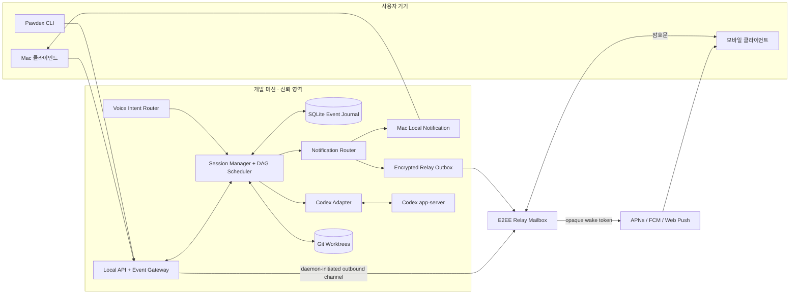
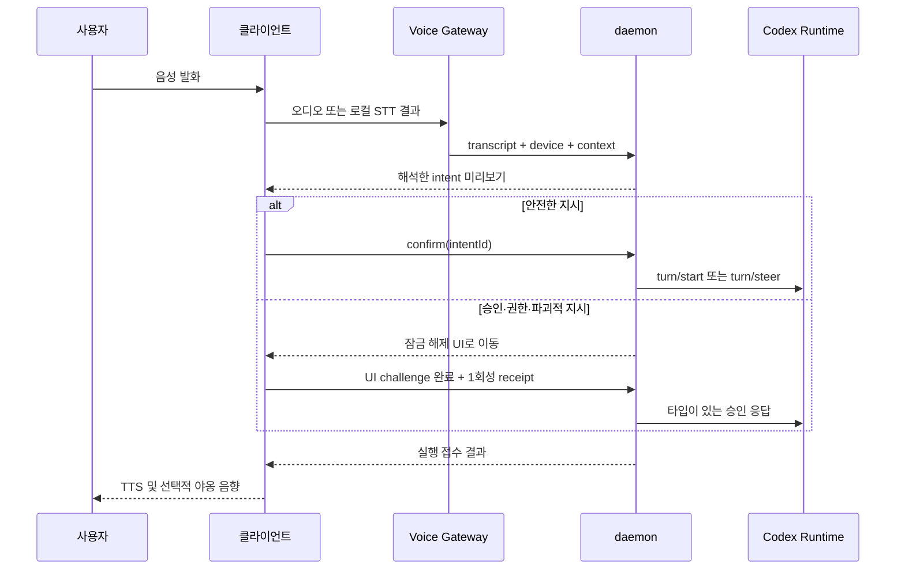

# Pawdex 기술 설계서

> 상태: **제안안(Proposal)**
> 대상: Pawdex v0.1~v1
> 최종 수정: 2026-09-07
> 범위: 런타임, 병렬 실행, 알림, 음성, 보안, 운영. UI/시각 디자인은 범위 밖이다.

## 1. 문서의 위치

현재 저장소의 daemon과 web 코드는 Codex app-server 연동 가능성을 확인한 **기술 스파이크**다. 공개 API나 영속 포맷으로 간주하지 않는다. 이 문서와 [PROTOCOL.md](./PROTOCOL.md)는 실제 구현을 시작하기 전에 합의할 목표 구조와 계약을 정의한다.

구현 원칙은 다음과 같다.

- 로컬 머신이 실행과 데이터의 기준점이다. daemon은 기본적으로 loopback에만 바인딩한다.
- Codex app-server는 버전이 바뀔 수 있는 외부 계약이다. 원문 JSON-RPC를 제품 전체로 누출하지 않는다.
- 원격 클라이언트에 임의 명령을 받는 raw shell API를 제공하지 않는다.
- 쓰기 작업은 기본적으로 독립 Git worktree에서 실행한다.
- 승인, 권한 상승, 파괴적 작업은 타입이 있는 요청과 사용자의 명시적 확인을 거친다.
- 복구 가능한 event journal을 먼저 기록한 뒤 클라이언트와 알림으로 전달한다.

## 2. 목표와 비목표

### 목표

1. 한 개발 머신에서 여러 Codex 세션을 동시에 실행하고 상태를 일관되게 보여준다.
2. `입력 필요`, `완료`, `실패`를 놓치지 않고 Mac과 모바일에 알린다.
3. 사용자가 음성으로 다음 지시, 세션 선택, 안전한 중단을 수행할 수 있게 한다.
4. 하나의 목표를 의존성이 있는 작업 그래프로 분해해 독립 작업을 병렬 실행한다.
5. daemon 재시작, 네트워크 단절, 중복 요청 뒤에도 상태와 승인을 안전하게 복구한다.
6. Codex app-server 버전 변화가 adapter 밖으로 전파되지 않게 한다.

### 비목표

- Pawdex가 자체 셸 호스팅 서비스가 되는 것
- 사용자의 확인 없이 브랜치 병합, 파일 삭제, 권한 상승을 수행하는 것
- 첫 버전에서 범용 CI/CD 오케스트레이터를 대체하는 것
- 첫 버전에서 여러 사용자 조직, 결제, 엔터프라이즈 RBAC를 완성하는 것
- UI 테마, 캐릭터 애니메이션, 최종 음향 디자인을 확정하는 것

## 3. 전체 구조



내부 Local Alpha에서는 `Relay`와 실제 Web Push 없이 Mac 로컬 알림, foreground event, provider fake만 검증한다. 실제 모바일/Web Push와 deep-link E2E는 기기 페어링·outbound E2EE relay가 준비된 원격 단계에서 함께 검증한다. 공개 P0에서는 이 인증된 원격 경로를 포함한다. 원격 연결을 단계적으로 붙여도 프로토콜을 다시 만들지 않도록 event envelope, device identity, cursor는 처음부터 구현한다.

## 4. 컴포넌트 책임

### 4.1 Local daemon

하나의 사용자 프로세스로 실행되는 제어 평면이다.

- HTTP 명령 API와 WebSocket 이벤트 스트림 제공
- 프로젝트, 세션, 턴, 태스크, 승인, 알림 설정 관리
- global/Machine/Project durable 실행 queue와 lease 관리
- SQLite transaction으로 명령 처리 결과와 이벤트를 원자적으로 기록
- app-server 프로세스 감독, 재시작, 호환성 확인
- worktree와 동시성 슬롯 관리
- 로컬 알림 및 원격 relay outbox 관리
- P0 local CLI에는 게시된 schema에서 생성한 API client만 제공하고 App Server stdio, SQLite, OS process control 직접 접근을 허용하지 않음

기본 주소는 `127.0.0.1` 또는 Unix domain socket이다. daemon은 LAN 또는 public interface에 직접 바인딩하지 않는다. 원격 기기 연결은 daemon이 외부 E2EE relay로 만드는 outbound 연결만 사용한다. 개발용 direct bind 예외도 제품 빌드에는 포함하지 않는다.

### 4.2 Codex adapter

위치는 `apps/daemon/src/codex`로 고정한다. 공식 app-server가 제공하는 thread/turn/item JSON-RPC를 Pawdex 도메인 명령과 이벤트로 변환한다.

- 연결마다 `initialize` → `initialized` 핸드셰이크 수행
- `thread/start`, `thread/resume`, `thread/fork` 수명 주기 래핑
- `turn/start`, `turn/steer`, `turn/interrupt` 명령 래핑
- app-server 서버 요청을 protocol canonical `approval.requested`로 변환한다. command/file/permission/user-input/MCP는 payload의 kind로 구분한다.
- 알 수 없는 **notification**은 원문 hash와 메서드만 진단 기록하고 상태 변경 없이 안전하게 무시
- 알 수 없는 **JSON-RPC server request**는 절대 무시하지 않고 fail-closed 오류로 응답한 뒤 해당 세션을 reconcile하고 `reconciliation_required` attention 생성
- 업스트림 request id와 Pawdex approval id 상호 매핑
- 앱 종료, timeout, malformed message를 정규화된 오류로 변환

server request capability 정책은 명시적으로 allowlist한다. P0는 command/file/permission approval, blocking/nonblocking user input, MCP elicitation만 지원한다. `item/tool/call` 같은 dynamic tool, 인증 갱신 요청, attestation 요청은 해당 app-server capability, Pawdex feature flag, 타입 구현이 모두 있을 때만 활성화한다. 협상되지 않은 요청은 위 fail-closed 경로를 탄다. 인증 갱신 token과 attestation 결과는 journal이나 클라이언트 이벤트에 기록하지 않는다.

한 app-server 프로세스가 여러 thread를 다중화하는 구성을 기본으로 한다. 프로세스 단위 격리가 필요해질 때도 adapter의 `CodexRuntime` 인터페이스 뒤에서 전략을 바꾼다.

권장 인터페이스는 다음과 같다.

```ts
interface CodexRuntime {
  connect(): Promise<RuntimeCapabilities>;
  createThread(input: CreateThread): Promise<RuntimeThread>;
  resumeThread(threadId: string): Promise<RuntimeThread>;
  forkThread(input: ForkThread): Promise<RuntimeThread>;
  startTurn(input: StartTurn): Promise<RuntimeTurn>;
  steerTurn(input: SteerTurn): Promise<void>;
  interruptTurn(input: InterruptTurn): Promise<void>;
  respondToRequest(input: TypedRuntimeResponse): Promise<void>;
  events(): AsyncIterable<RuntimeEvent>;
  close(): Promise<void>;
}
```

### 4.3 Session Manager

`Pawdex session id`와 `Codex thread id`를 분리한다. 사용자에게는 안정적인 Pawdex id만 노출한다.

- 세션 상태 전이 검증
- 세션별 활성 턴은 최대 하나로 제한
- 실행 중 추가 지시는 `turn/steer`, 준비/완료 상태의 새 지시는 `turn/start`로 라우팅
- 대기 승인과 원래 app-server request id의 수명 주기 관리. `serverRequest/resolved`는 일치하는 요청 하나만 해결하며 다른 blocker를 보존
- app-server 이벤트의 중복·역순 수신 방어
- 세션 상태 변경과 attention 생성의 원자성 보장

세션 상태는 마지막 이벤트 하나로 추정하지 않는다. `Thread.status`, `thread/status/changed`, 현재 turn 상태, `activeFlags.waitingOnApproval`, `activeFlags.waitingOnUserInput`, 미해결 blocking request를 함께 reducer에 넣는다. `serverRequest/resolved` 후에는 남은 blocker와 현재 turn을 다시 계산하며 무조건 `running`으로 복귀하지 않는다. user-input 요청의 `isBlocking=false`는 attention만 생성하고 세션을 `needs_input`으로 바꾸지 않는다.

upstream mapping/reducer가 계산한 Session 상태가 달라지면 Session projection 변경과 protocol canonical `session.state_changed`를 같은 SQLite transaction에 기록한다. Approval/Turn/runtime 관찰 이벤트만 남기고 Session 상태를 암묵적으로 바꾸지 않는다.

정규 상태와 이벤트 규칙은 [PROTOCOL.md](./PROTOCOL.md)에 정의한다.

### 4.4 DAG Scheduler

오케스트레이션 단위는 `Plan`과 `Task`다. Plan은 `draft → proposed → editing → validated → frozen → confirmed → running`을 거친다. `confirmed` 전에는 어떤 task도 실행하지 않으며, `frozen` 이후 수정은 새 revision과 재검증을 요구한다.

- `Plan`: 사용자 목표, 대상 프로젝트, 정책, 전체 상태
- `Task`: 프롬프트, 의존 태스크, 읽기/쓰기 모드, 예상 산출물, 실행 세션
- `Edge`: 선행 작업 완료 조건
- `Lane`: 같은 파일이나 공유 자원을 수정하는 태스크의 직렬화 그룹

스케줄러 규칙:

1. 모든 선행 태스크가 `succeeded`인 `queued` 태스크만 실행 후보가 된다.
2. 실패한 선행 태스크가 있으면 후속 태스크는 `blocked`가 된다. 자동 우회는 정책에 명시된 경우만 허용한다.
3. P0는 global, Machine, Project 세 동시성 제한을 모두 적용한다. 모델/provider별 별도 한도는 P1 확장으로 둔다.
4. 읽기 전용 태스크는 같은 checkout을 공유할 수 있다. 쓰기 태스크는 태스크별 worktree를 사용한다.
5. 같은 lane의 쓰기 태스크는 동시에 시작하지 않는다.
6. 재시도는 오류가 재시도 가능하고, 아직 side effect 확정 전이며, 정책의 횟수 안일 때만 한다.
7. 완료 산출물을 다른 태스크에 전달할 때는 전체 대화가 아니라 명시된 artifact와 짧은 handoff 요약을 사용한다.

validator는 DAG cycle, 존재하지 않는 dependency, write task의 managed worktree, lane 충돌, artifact producer/consumer, 동시성 한도를 검사한다. scheduler가 `ready → dispatching → running`을 전이할 때 operation row와 task lease를 먼저 transaction으로 기록한다. task 종료 시 산출물은 `artifact_id`, 종류, 생성 task, worktree commit/blob reference, content hash, redacted handoff summary로 등록하며 후속 task는 선언된 artifact만 입력으로 받는다.

실행 요청은 global, Machine, Project queue에 정확히 하나씩 세 durable entry를 만들고 세 scope slot을 모두 포함한 composite lease가 있어야 시작한다. 한 SQLite transaction에서 세 한도/queue 상태를 검사해 전부 acquire하거나 전부 rollback한다. queue는 `running|paused`, entry는 `queued|leased|running|paused|completed|cancelled`를 사용한다. rate/usage limit은 영향 scope를 `paused`로 만들고 pause reason과 resume-after를 저장한다. dispatch 실패·terminal·cancel 시 세 grant를 원자적으로 release하며, daemon 재시작 후 세 entry/lease와 runtime을 reconcile하기 전에는 같은 operation을 재실행하지 않는다.

P0의 `needsInputSlotPolicy` 기본값은 `release_active_slot`이다. blocking 입력 대기 시 active-turn composite lease를 반납하고 entry를 `paused(waiting_on_input)`로 두되, 살아 있는 app-server thread는 global/Machine/Project별 `residentNeedsInputCount`와 별도 limit으로 계수한다. 응답 접수 후 세 scope slot을 다시 얻은 다음 upstream response를 보내며, 재시작 시 thread status/active flags/pending Approval로 paused entry와 resident count를 복구한다. `hold_active_slot`은 ProjectPolicy의 명시적 선택이고 nonblocking 입력은 lease를 바꾸지 않는다.

Task retry는 새 `TaskAttempt`와 lease를 만들며 이전 Session, worktree, verification result를 보존한다. 검증은 ProjectPolicy에 등록된 executable/template와 schema 검증된 argv만 사용하고 remote raw shell을 허용하지 않는다. required verification의 exit code, duration, redacted output artifact가 모두 완료 조건을 만족해야 Task가 `succeeded`가 된다.

P0는 사용자의 자동 분할 요청을 Planner가 초안 Plan/Task DAG로 변환하는 기능을 포함한다. 다만 자동화 범위는 분해·제안·검증까지이며, **모든 P0 Plan은 사용자가 해당 revision과 Task 목록을 confirm한 뒤에만 실행**한다. 아래 조건은 P1에서 정책 기반 조건부 자동 실행을 도입하더라도 항상 사람 확인을 요구한다.

- 세 개를 초과하는 쓰기 태스크를 동시에 시작
- 외부 서비스 변경이나 배포가 포함됨
- 예상 변경 범위가 프로젝트 allowlist 밖임
- 최종 통합 방식이 merge/rebase/cherry-pick 중 확정되지 않음

### 4.5 Worktree Manager

쓰기 태스크의 격리 단위다. worktree 경로와 브랜치는 daemon이 구조화된 인자로 Git을 직접 호출해 생성한다. 셸 문자열을 원격 입력으로 실행하지 않는다.

P0에서 독립 Session과 Plan Task의 모든 쓰기는 Git managed worktree만 사용한다. Git이 아니거나 worktree를 만들 수 없는 Project는 read-only이며, managed-copy 격리는 P1이다. 독립 Session의 worktree owner는 Session, DAG 실행의 owner는 해당 TaskAttempt다. daemon은 worktree를 먼저 예약·생성하고 정확한 cwd를 얻은 뒤 thread를 시작하며, 생성 실패를 기본 checkout 쓰기로 우회하지 않는다.

브랜치 namespace도 책임별로 분리한다. 기여자가 Pawdex 코드 변경과 PR에 쓰는 브랜치는 `codex/<type>-<feature-id>-<short-name>`이고, daemon이 실행 중 자동 생성하는 내부 브랜치는 `codex/pawdex/<plan-short-id>/<task-attempt-short-id>`다. runtime은 기여자 브랜치를 managed worktree 정리 대상으로 취급하지 않는다.

수명 주기:

1. **Preflight**: 저장소 여부, 기준 ref, dirty working tree, 동일 브랜치 사용 여부, 디스크 공간 확인
2. **Reserve**: task id에 branch/worktree 레코드, 정확한 canonical path, Git common-dir identity를 원자적으로 예약
3. **Create**: `codex/pawdex/<plan-short-id>/<task-attempt-short-id>` 형태의 내부 브랜치와 관리 디렉터리에 worktree 생성
4. **Attach**: worktree 절대 경로를 Codex thread의 `cwd`로 지정
5. **Run**: 파일 변경과 테스트 실행은 worktree 안으로 제한
6. **Inspect**: diff, 테스트 결과, commit 상태를 artifact로 기록
7. **Integrate**: 사용자가 선택한 merge/cherry-pick/patch-export를 별도 승인 명령으로 실행
8. **Cleanup**: 실행 중 프로세스가 없고 변경 보존 여부를 확인한 뒤 제거

Attach와 모든 Git mutation은 요청 경로가 DB에 예약된 canonical path와 정확히 일치하고, 현재 `git rev-parse --git-common-dir` identity가 예약 당시 값과 일치할 때만 허용한다. 단순히 프로젝트 root 아래라는 이유로 신뢰하지 않는다. dirty, untracked, ignored 또는 아직 통합되지 않은 commit이 하나라도 있으면 cleanup은 항상 잠금 해제된 로컬 UI의 명시적 확인을 요구한다. 충돌을 자동으로 해결하거나 변경 있는 worktree를 자동 삭제하지 않는다. 비정상 종료 후에는 `orphaned`로 표시하고 복구 또는 정리 선택지를 제공한다.

### 4.6 Event Journal과 Projection

이벤트는 UI 전송 전에 SQLite에 기록한다. 목표는 exactly-once 실행이 아니라 **at-least-once 전달 + 멱등 소비**다.

- 단조 증가하는 머신 범위 `sequence`
- aggregate별 `revision`
- 모든 command에 `idempotency_key`와 payload hash
- upstream 호출 전에 `operations` row를 기록하고, turn start/steer에는 command id와 idempotency key로 결정적으로 생성한 `clientUserMessageId` 사용
- 상태 projection과 event append를 하나의 transaction에서 처리
- 알림은 outbox row를 같은 transaction에서 생성
- 클라이언트는 마지막 처리 `sequence`를 cursor로 저장
- 보존 구간보다 오래된 cursor는 `CURSOR_EXPIRED` 오류로 거절

`PawdexEvent`는 journal에 기록된 durable event만 뜻한다. 토큰 델타는 별도 `ephemeral` WebSocket frame이며 durable `sequence`나 aggregate `revision`을 소비하지 않는다. 따라서 delta 유실이 cursor gap으로 보이지 않는다. 최종 `item/completed` 또는 합쳐진 메시지를 canonical durable event로 저장한다. 감사가 필요한 승인과 상태 전이는 전부 보존한다.

한 SQLite transaction의 deterministic 순서는 `operation 상태 → projection 변경 → aggregate별 event(고정 type/id 정렬) → attention → notification outbox`다. commit 후 sequence 순서로 publish한다. `thread/start` 결과를 받지 못한 모호한 실패는 operation을 `outcome_unknown`으로 두고 새 thread를 blind retry하지 않는다. 이후 thread list/read와 `clientUserMessageId`로 orphan을 찾고 연결하거나 사용자의 정리 대상으로 표시한다.

재연결 절차:

1. 클라이언트가 마지막 cursor와 함께 event ticket을 요청한다.
2. daemon이 ticket과 cursor의 장치/권한을 검증한다.
3. journal에 cursor가 남아 있으면 이후 이벤트를 순서대로 replay한다.
4. 없으면 snapshot과 새 base cursor를 내려준다.
5. 실시간 스트림으로 전환하는 순간까지 새 이벤트는 동일 연결 큐에 보관한다.

### 4.7 Notification Router

protocol canonical `attention.created` 이벤트를 전달 채널별 notification job으로 fan-out한다.

| Tier | 채널 | 목적 | 제약 |
|---|---|---|---|
| 0 | Mac 로컬 알림 + 로컬 음향 | 같은 머신에서 가장 빠른 알림 | daemon/companion 실행 필요 |
| 1 | foreground event + provider fake | relay 전 로컬 채널 계약 검증 | 실제 background push가 아님 |
| 2 | Web Push opaque wake-up | 설치 부담 없는 모바일 알파 | outbound E2EE relay 필수, OS/browser별 백그라운드 및 음향 제약 |
| 3 | APNs/FCM opaque wake-up | 안정적 모바일 푸시 | outbound E2EE relay, 앱 배포, push credential 필요 |

알림 정책:

- 기본 알림 대상은 `needs_input`, `completed`, `failed`다.
- `isBlocking=false` 사용자 입력 요청은 attention inbox에는 나타내되 기본 push 대상에서는 제외하며, 사용자가 별도로 활성화할 수 있다.
- dedup key는 `deviceId + attentionId + policyRevision + stage`의 canonical encoding이며 최초 전송과 각 escalation stage를 구분한다.
- `needs_input`은 사용자가 답하거나 요청이 만료되면 철회/갱신한다.
- quiet hours에는 실패를 제외하고 묶어서 보낸다. 정책은 사용자 설정으로 변경 가능하다.
- 같은 세션의 짧은 시간 내 연속 완료는 하나로 묶을 수 있다.
- public push provider payload는 relay가 내부적으로 device mailbox에 매핑하는 짧게 만료되는 1회성 `wakeToken`만 포함한다. 세션 별칭, 상태, attention id, preview, 안정적인 device 식별자는 넣지 않는다. 기기가 깨어난 뒤 E2EE relay에서 내용을 가져온다.
- Web Push에서 커스텀 소리 재생은 OS 정책에 따라 보장되지 않는다. 확실한 `야옹` 소리는 foreground 클라이언트 또는 네이티브 알림 채널이 담당한다.
- delivery 상태는 `queued`, `provider_accepted`, `device_acknowledged`, `opened`, `acted`, `failed`, `expired`로 추적한다.
- blocking/nonblocking 사용자 입력 모두 `needs_input` Attention을 만들 수 있지만 `blocking=false`는 Session 상태나 concurrency 계산을 바꾸지 않으며 알림 정책이 억제할 수 있다.

### 4.8 Voice Pipeline

음성은 실행 엔진이 아니라 입력 채널이다.



단계는 `VAD → STT → intent parse → target resolution → policy check → confirmation → command → TTS`다.

초기 intent 집합:

- `send_instruction(sessionRef, text)`
- `steer_active_session(text)`
- `create_session(projectRef, instruction)`
- `fork_session(sessionRef, instruction)`
- `interrupt_session(sessionRef)`
- `read_status(scope)`
- `answer_question(approvalId, answers)`
- `respond_approval(approvalId, decision)`

세션 별칭이 모호하면 실행하지 않고 후보를 되묻는다. 세션이 `needs_input`이면 typed answer/decision만 해당 blocker로 라우팅한다. 일반 후속 지시는 정책에 따라 `queued_after_blocker`로 저장하거나 `STATE_CONFLICT`로 거절하고 blocker를 해제하지 않는다. 사용자 질문 답변은 음성으로 제출할 수 있지만, 위험도와 무관하게 모든 approval accept는 음성으로 완료할 수 없다. 음성은 잠금 해제된 명시적 UI로 이동하거나 `decline`/`cancel`만 수행한다.

STT/TTS provider는 adapter로 격리한다. 기본값은 가능한 범위에서 온디바이스 처리이며, 외부 provider 사용 시 오디오 보존 여부와 전송 대상을 명시한다. 원본 음성은 기본 저장하지 않는다.

## 5. 데이터 모델

MVP 영속 계층은 SQLite WAL 모드를 사용한다. JSON 파일 저장은 스파이크에만 허용한다.

| 테이블 | 주요 필드 | 설명 |
|---|---|---|
| `projects` | `id`, `root_path`, `git_common_dir`, `policy_json` | 허용된 로컬 프로젝트 |
| `sessions` | `id`, `project_id`, `runtime_thread_id`, `state`, `revision`, `execution_mode`, `worktree_id`, `cwd` | 독립/Task 실행 Pawdex 세션 projection |
| `turns` | `id`, `session_id`, `runtime_turn_id`, `state`, `started_at`, `ended_at` | 턴 이력 |
| `plans` | `id`, `project_id`, `goal`, `base_git_revision`, `state`, `revision`, `document_json`, `frozen_document_hash`, `policy_json` | scope/artifact graph/checkpoint를 포함한 crash-recoverable DAG 문서 |
| `tasks` | `id`, `plan_id`, `mode`, `state`, `lane`, `current_attempt_id`, `scope_json`, `risk`, `checkpoints_json`, `produced_artifacts_json`, `consumed_artifacts_json`, `completion_json`, `verification_json` | 세부 작업 정의와 결과 계약 |
| `task_attempts` | `id`, `task_id`, `ordinal`, `state`, `lease_id`, `session_id`, `worktree_id`, `source_turn_id`, `result_summary`, `changed_files_json`, `artifact_ids_json`, `verification_result_ids_json` | retry별 불변 실행·결과 이력 |
| `task_edges` | `from_task_id`, `to_task_id`, `condition` | 의존성 |
| `worktrees` | `id`, `owner_type`, `owner_id`, `path`, `git_common_dir_id`, `branch`, `base_ref`, `state`, `revision` | Session 또는 TaskAttempt 소유 자원 |
| `execution_queues` | `id`, `scope_type`, `scope_id`, `state`, `pause_reason`, `resume_after`, `active_limit`, `resident_needs_input_count`, `resident_limit`, `needs_input_slot_policy`, `revision` | global/Machine/Project queue projection |
| `queue_entries` | `id`, `queue_id`, `operation_id`, `state`, `priority`, `lease_id` | durable 실행 대기열 |
| `execution_leases` | `id`, `operation_id`, `attempt_id`, `expires_at`, `heartbeat_at`, `state` | 세 scope를 묶는 composite lease |
| `lease_grants` | `lease_id`, `queue_id`, `queue_entry_id`, `scope_type` | global/Machine/Project별 정확히 세 grant; transaction unique constraint |
| `verification_results` | `id`, `attempt_id`, `spec_id`, `exit_code`, `duration_ms`, `passed`, `artifact_id` | allowlisted 검증 결과 |
| `artifacts` | `id`, `artifact_spec_id`, `producer_attempt_id`, `kind`, `content_hash`, `reference`, `handoff_summary` | frozen ArtifactSpec과 결정적으로 연결된 결과 전달 계약 |
| `approvals` | `id`, `session_id`, `runtime_request_id`, `kind`, `request_json`, `state`, `is_blocking` | 승인 및 질문; secret answer 값은 저장 금지 |
| `attentions` | `id`, `session_id`, `kind`, `revision`, `resolved_at` | 사용자 주의가 필요한 사건 |
| `events` | `sequence`, `event_id`, `aggregate_id`, `revision`, `type`, `payload_json` | append-only journal |
| `operations` | `id`, `idempotency_key`, `payload_hash`, `client_message_id`, `status`, `response_json` | upstream 전 기록, 중복 명령·모호한 결과 복구 |
| `notification_jobs` | `id`, `attention_id`, `device_id`, `policy_revision`, `stage`, `dedup_key`, `channel`, `state` | transactional outbox와 7단계 delivery 상태 |
| `devices` | `id`, `public_key`, `capabilities_json`, `last_seen_at` | 페어링된 기기 |

로컬 경로와 command preview는 민감 정보로 분류한다. secret input과 form answer 값은 DB, event, 로그에 저장하지 않고 runtime에 전달한 뒤 즉시 폐기한다. 감사 로그에는 field id, 제출/누락 여부, redacted marker와 hash 없는 길이 범주만 남긴다.

## 6. app-server 수명 주기와 호환성

공식 OpenAI 문서가 설명하는 app-server의 핵심 흐름은 연결별 `initialize`/`initialized`, thread 생성·재개·포크, turn 시작·조정·중단, streamed item/turn 이벤트, 서버 발신 승인·질문 요청이다. 구현은 이 계약을 직접 복제하지 않고 생성된 타입과 adapter fixture를 사용한다.

### 시작

1. 설정된 binary를 절대 경로로 확인하고 `--version`을 수집한다.
2. 지원 버전 범위와 비교한다. 알 수 없는 버전은 기본적으로 경고 후 읽기 전용 진단 상태가 된다.
3. stdio transport로 app-server를 시작한다.
4. `initialize`를 보내고 서버 정보/기능을 저장한다.
5. `initialized`를 보낸다.
6. DB에 있는 활성 thread를 제한된 병렬도로 `thread/resume`한다.
7. `thread/read`/resume 결과의 `Thread.status`와 이후 `thread/status/changed`를 받아 `activeFlags.waitingOnApproval`, `activeFlags.waitingOnUserInput`, 현재 turn을 projection과 대조한다.
8. 미해결 server request의 연결 유효성을 확인하고 projection을 재조정한 뒤 API readiness를 올린다.

### 감독과 재시작

- 비정상 종료 시 진행 세션을 곧바로 `failed`로 단정하지 않고 `offline`으로 표시한다.
- exponential backoff와 jitter로 제한된 횟수만 재시작한다.
- 재연결 후 thread를 resume/read하여 `Thread.status`, active flags, 현재 turn, blocking request를 기준으로 최종 상태를 재조정한다.
- 대기 중 승인 request id는 연결 수명에 묶일 수 있으므로 재확인 전 응답하지 않는다.
- 확정할 수 없는 결과는 `reconciliation_required` attention으로 승격한다.

### 스키마 관리

- 지원하는 각 app-server 버전에서 `app-server generate-ts` 또는 `generate-json-schema` 결과를 fixture로 보관한다.
- adapter는 `stable` 기능만 기본 활성화한다. 실험적 API는 기능 플래그와 명시된 최소/최대 버전을 요구한다.
- CI에서 schema diff를 생성하고 삭제, required 변경, enum 축소를 breaking change로 취급한다.
- 각 upstream notification과 server request 매핑에는 state-machine fixture test를 둔다.
- `RuntimeCapabilities`로 지원 메서드, approval 종류, experimental 기능을 노출하되 클라이언트는 capability가 없을 때 기능을 숨기거나 안전하게 거절한다.
- command approval의 `approvalId`, command/writeStdin kind, `applyNetworkPolicyAmendment`, 제안된 exec/network amendment id와 hash를 보존한다. 클라이언트는 upstream이 제안한 id/hash를 선택만 할 수 있고 새 정책 문자열을 만들 수 없다.
- user input 응답은 upstream의 `{answers}`만 사용하고 취소는 별도 `turn/interrupt`로 처리한다. permission 응답은 `{permissions, scope, strictAutoReview?}`, MCP elicitation 응답은 호환성용 `_meta: null`을 포함하도록 adapter에서 합성한다.

공식 기준 문서: [Codex app-server](https://learn.chatgpt.com/ko-KR/docs/app-server), [Git worktrees](https://learn.chatgpt.com/ko-KR/docs/environments/git-worktrees).

## 7. 신뢰 경계와 보안

### 경계

1. **로컬 사용자 ↔ daemon**: 같은 OS 사용자라도 Origin/CSRF와 로컬 악성 페이지를 고려한다.
2. **daemon ↔ Codex app-server**: 자식 프로세스 출력은 스키마 검증 전까지 신뢰하지 않는다.
3. **daemon ↔ worktree/Git**: 경로는 DB에 예약된 canonical path와 정확히 일치하고 Git common-dir identity가 일치하는지 검증한다.
4. **daemon ↔ relay/push**: 외부 인프라는 알림 내용을 읽을 수 있다고 가정하지 않는다.
5. **기기 ↔ 사용자 음성**: 오인식과 도난 기기를 권한 위임으로 간주하지 않는다.

### 필수 통제

- loopback/Unix socket 전용. LAN/public direct bind 금지, 원격 통신은 outbound E2EE relay만 사용
- 기기 페어링 시 짧은 수명의 QR/코드와 공개키 교환
- 원격 message body end-to-end encryption, relay에는 routing metadata만 노출
- access token은 짧게, refresh secret은 OS Keychain/Keystore에 저장
- WebSocket query에 장기 bearer token을 넣지 않고 일회성 event ticket 사용
- 등록 프로젝트 allowlist와 canonical realpath 검사로 path traversal/symlink escape 방어
- 명령을 문자열 셸로 조립하지 않고 구조화된 argv로 실행
- raw shell endpoint 금지
- 승인 종류별 응답 schema 검증, 요청에 없는 권한 부여 금지
- network, session-scope, Project/worktree 밖 접근 등 권한 상승과 파괴적 외부 작업은 `respond_elevated` scope 및 잠금 해제 UI의 device-bound confirmation receipt 요구. ProjectPolicy allowlist 밖과 worktree 밖 쓰기는 receipt가 있어도 거절
- 음성은 위험도와 무관하게 approval accept를 완료할 수 없고 UI로 이동하거나 decline/cancel만 가능
- public push payload는 opaque wake-up만 허용하고 prompt, 상태, 세션명, attention id, 경로, diff를 포함하지 않음
- 모든 승인 요청·응답은 사용자, 기기, 시간, 대상, 결정과 함께 감사 이벤트로 남김

공개 P0의 relay/E2EE wire contract는 [PROTOCOL.md의 원격 relay와 E2EE](./PROTOCOL.md#14-원격-relay와-e2ee)에 따른다. 구현이 완료되기 전에는 모바일 인터넷 제어를 노출하지 않는다. VPN/LAN direct bind를 우회로 사용하지 않는다.

## 8. 실패 모드

| 실패 | 사용자 상태 | 자동 동작 | 금지 동작 |
|---|---|---|---|
| app-server 종료 | `offline` | backoff 재시작, thread 재조정 | 완료로 추정 |
| daemon 재시작 | machine/runtime `offline` | journal/DB 복구, outbox 재개 | 중복 turn 생성 |
| 이벤트 순서 틀림 | 기존 상태 유지 | revision 검사, 재조회 | 낮은 revision 적용 |
| worktree 생성 실패 | task `failed` | 진단 artifact 생성 | 기본 checkout으로 우회 |
| push 실패 | job 재시도 | backoff, 다른 채널 fallback | 같은 알림 무한 반복 |
| STT 모호성 | intent `needs_confirmation` | 후보 재질문 | 임의 세션 선택 |
| 승인 만료 | approval `expired` | 현재 runtime 상태 조회 | 오래된 request id 응답 |
| relay 단절 | device `offline` | 암호화 outbox 제한 보관 | 평문 fallback |

## 9. 관측 가능성

로컬 기본 로그는 JSON Lines로 남기되 prompt, 음성 transcript, command 전체, 환경 변수, token을 redaction한다.

필수 correlation 필드:

- `trace_id`, `command_id`, `event_id`
- `plan_id`, `task_id`, `session_id`, `turn_id`
- `runtime_version`, `adapter_version`
- `device_id`, `notification_job_id`

필수 지표:

- 동시 실행 세션 수, queue wait time, turn duration
- 상태별 세션 수, 입력 대기 시간, 승인 응답 시간
- runtime restart/reconcile 횟수
- 이벤트 replay lag, journal/outbox backlog
- 알림 채널별 전달/ack/실패율
- STT latency, intent confirmation/취소율
- worktree 생성/정리 실패 및 orphan 수

외부 telemetry는 opt-in이며 content-free 집계만 허용한다. 진단 번들은 사용자 검토 후 내보낸다.

## 10. 배포 형태

### 개발/로컬 알파

- pnpm workspace의 daemon + 브라우저 클라이언트
- daemon은 로그인된 사용자의 Codex binary를 child process로 사용
- SQLite와 worktree는 사용자 홈의 Pawdex 전용 디렉터리
- macOS launch agent는 사용자가 명시적으로 활성화할 때만 설치

### 데스크톱 베타

- 서명된 Mac companion이 daemon의 설치, 자동 시작, Notification Center, 마이크 권한을 담당
- daemon core와 UI shell의 버전을 독립적으로 표시하고 호환 범위를 검사

### 원격/모바일 베타

- stateless relay + encrypted mailbox + push wake-up
- relay 장애가 로컬 실행을 중단하지 않음
- native app은 APNs/FCM, Secure Enclave/Keychain, background reconnect를 담당

업데이트는 서명 검증과 rollback 가능한 설치를 전제로 한다. binary 자동 교체는 별도 사용자 정책이며 Codex 자체 설치를 Pawdex가 임의 수정하지 않는다.

## 11. 테스트 전략

### 단위 테스트

- 모든 upstream event → normalized event → 상태 전이 매핑
- 유효하지 않은 전이, 중복 sequence, 역순 revision 거절
- 승인 종류별 실제 upstream payload validation과 device-bound confirmation challenge/receipt
- DAG ready-set, lane lock, 실패 전파, 재시도 정책
- notification dedupe, quiet hours, escalation
- voice target disambiguation과 위험 intent 분류

### 계약 테스트

- pin된 app-server schema를 생성하고 adapter 타입과 비교
- 실제 버전별 JSONL fixture replay
- 알 수 없는 notification은 안전하게 무시하고 알 수 없는 server request는 오류 응답·reconciliation attention으로 fail-closed하는지 확인
- dynamic tool/auth refresh/attestation capability on/off matrix
- `serverRequest/resolved`가 대상 하나만 해제하고 나머지 blocker 및 현재 turn 상태를 보존하는지 확인
- `isBlocking=false` user-input이 attention만 만들고 세션 실행 상태를 유지하는지 확인

새 Codex 이벤트 매핑을 추가할 때 state-machine test는 필수다.

### 통합 테스트

- 실제 app-server로 thread start/resume/fork와 turn start/steer/interrupt 실행
- 승인, 사용자 입력, MCP elicitation round-trip
- daemon kill/restart와 진행 thread reconciliation
- 두 개 이상의 쓰기 태스크가 서로 다른 worktree에서 파일을 수정하는지 확인
- client cursor reconnect 중 이벤트 유실/중복이 없는지 확인
- local CLI가 loopback typed API만 사용하고 revision/idempotency를 누락하거나 raw shell/RPC pass-through를 요청하면 거부되는지 확인

### 장애/보안 테스트

- malformed JSON-RPC, stdout flood, child hang, timeout
- SQLite busy/crash recovery, outbox 중복 전송
- symlink/path traversal, Origin/CSRF, replayed event ticket
- 도난/해제된 device key와 만료 confirmation challenge/receipt
- 네트워크 단절 중 음성/승인 재시도

### 출시 게이트

- P0 상태 전이 fixture 100% 통과
- 승인 우회 및 raw shell 경로 0건
- daemon 강제 종료 후 중복 turn 0건
- 24시간 다중 세션 soak test에서 event loss 0건
- 세 지원 플랫폼 버전에서 알림/음성 권한 시나리오 확인
- Planner가 제안한 모든 P0 Plan에서 confirm 전 worktree·Session·Task 실행 0건

## 12. 권장 구현 순서

1. 프로토콜 타입, SQLite journal, migration, state reducer
2. app-server generated schema와 adapter contract tests
3. Project 경계, 단일/다중 Session, global/Machine/Project durable queue, generated local CLI
4. typed approval/질문, cursor 기반 API·이벤트 스트림
5. worktree manager, Planner/DAG scheduler, 사용자 확인형 typed 통합
6. attention inbox, notification outbox, Mac 로컬 알림, foreground event, provider fake
7. device pairing, E2EE relay, 실제 Web Push/네이티브 push, 모바일 deep link
8. voice STT/intent/질문 answer/confirmation/TTS
9. 호환성·보안·복구 하드닝과 공개 MVP gate

각 단계는 이전 단계의 상태와 보안 계약을 재사용해야 하며, UI 설계와 독립적으로 검증 가능해야 한다.

## 13. 확정이 필요한 결정

자동 Task DAG 제안의 P0 포함 여부와 실행 경계는 [ADR-013](./DECISIONS.md#adr-013-자동-작업-분해의-p0-경계)으로 확정했다. 아래 목록은 여전히 열려 있는 결정만 다룬다.

- 지원할 Codex app-server 최소/최대 버전과 업데이트 정책
- v1 모바일을 PWA로 한정할지, 네이티브 앱을 함께 출시할지
- relay를 공식 호스팅할지 self-host 패키지만 제공할지
- P1 정책 기반 조건부 자동 실행을 허용할 안전 범위와 항상 재확인할 조건
- P1 자동 PR 생성 여부와 GitHub/GitLab 등 코드 호스팅 adapter의 지원 범위(P0의 사용자 확인형 typed cherry-pick/merge/patch-export는 확정)
- event/token content의 기본 보존 기간
- 음성 STT/TTS 기본 provider와 완전 로컬 모드 지원 범위

이 결정은 기능 범위와 운영 비용에 영향을 주지만, 로컬-first·타입 승인·adapter 경계·event journal 원칙은 변경하지 않는다.
